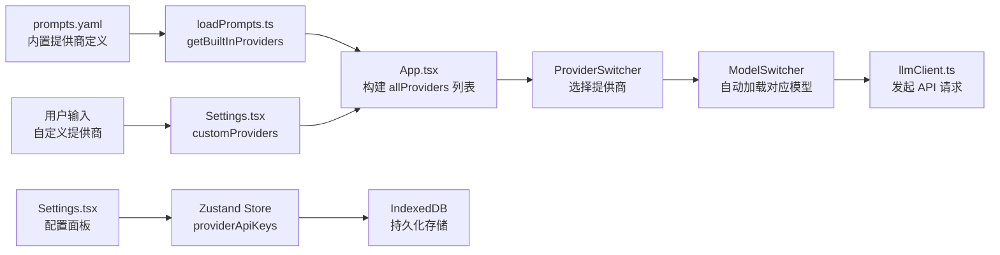
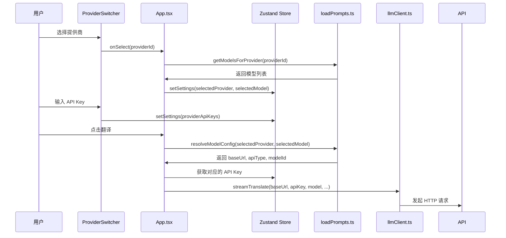

现在信息已经收集完毕，让我编写这个 Wiki 页面。

---

# API 密钥与提供商配置

在 Moe Translate 中，你的每一次翻译请求都需要通过一个 **LLM 提供商**（如 DeepSeek、OpenAI）的 API 来完成。这个页面会带你理解：有哪些内置提供商可选、它们的模型和价格如何、如何切换提供商、以及如何添加你自己的自定义提供商。

## 整体架构概览

提供商配置在整个应用中的角色可以用下图表示：



图中的核心逻辑是：`prompts.yaml` 定义内置提供商，`Settings.tsx` 管理 API 密钥和自定义提供商，`ProviderSwitcher` 负责切换，`ModelSwitcher` 响应切换自动更新模型列表。

[来源](src/lib/prompts/prompts.yaml#L135-L423) | [来源](src/lib/prompts/loadPrompts.ts#L236-L258) | [来源](src/App.tsx#L86-L106)

---

## 内置提供商完整列表

所有内置提供商都在 `prompts.yaml` 的 `providers` 字段中定义。每个提供商包含以下元信息：

- **`base_url`**：API 端点地址
- **`api_type`**：API 协议类型（决定 `llmClient.ts` 如何构造请求）
- **`models`**：该提供商下的模型列表，每个模型包含名称、上下文窗口、定价等

以下是目前全部 **6 个内置提供商** 的信息汇总：

| 提供商 | 标识符 | `api_type` | `base_url` |
| --- | --- | --- | --- |
| DeepSeek | `deepseek` | `openai` | `https://api.deepseek.com` |
| OpenAI | `openai` | `openai` | `https://api.openai.com/v1` |
| Anthropic | `anthropic` | `anthropic` | `https://api.anthropic.com` |
| Google Gemini | `google` | `google` | `https://generativelanguage.googleapis.com/v1beta` |
| xAI Grok | `xai` | `openai` | `https://api.x.ai/v1` |
| Mistral AI | `mistral` | `openai` | `https://api.mistral.ai/v1` |
| Cohere | `cohere` | `openai` | `https://api.cohere.com/v1` |

目前 `api_type` 支持三种：`openai`（兼容 OpenAI 格式）、`anthropic`（Anthropic 格式）、`google`（Google Gemini 格式）。自定义提供商默认使用 `openai` 类型。

[来源](src/lib/prompts/prompts.yaml#L135-L423) | [来源](src/lib/prompts/loadPrompts.ts#L236-L258)

---

### 各提供商模型详情（含定价）

以下列出每个提供商下的模型及其关键参数。

> 定价单位：美元/百万 token（`pricing_input` 为输入价格，`pricing_output` 为输出价格）。`max_context` 表示上下文窗口大小（token）。`supports_thinking` 标记该模型是否支持显示推理过程。

#### DeepSeek

| 模型 ID | 显示名称 | max_context | 输入价格 | 输出价格 | 思考链 |
| --- | --- | --- | --- | --- | --- |
| `deepseek-v4-flash` | DeepSeek V4 Flash | 1,000,000 | $0.14 | $0.28 | ✅ |
| `deepseek-v4-pro` | DeepSeek V4 Pro | 1,000,000 | $0.435 | $0.87 | ✅ |

#### OpenAI

| 模型 ID | 显示名称 | max_context | 输入价格 | 输出价格 | 思考链 |
| --- | --- | --- | --- | --- | --- |
| `gpt-5.5` | GPT-5.5 (Flagship) | 400,000 | $5.00 | $30.00 | ❌ |
| `gpt-5.5-pro` | GPT-5.5 Pro (Ultra) | 400,000 | $30.00 | $180.00 | ✅ |
| `gpt-5.4` | GPT-5.4 (Balanced) | 400,000 | $2.50 | $15.00 | ❌ |
| `gpt-5.4-pro` | GPT-5.4 Pro (Enhanced) | 400,000 | $30.00 | $180.00 | ✅ |
| `gpt-5.4-mini` | GPT-5.4 Mini (Budget) | 128,000 | $0.75 | $4.50 | ❌ |
| `gpt-5.4-nano` | GPT-5.4 Nano (Low-cost) | 128,000 | $0.20 | $1.25 | ❌ |

#### Anthropic

| 模型 ID | 显示名称 | max_context | 输入价格 | 输出价格 | 思考链 |
| --- | --- | --- | --- | --- | --- |
| `claude-opus-4-7` | Claude Opus 4.7 (Flagship) | 1,000,000 | $5.00 | $25.00 | ✅ |
| `claude-opus-4-6` | Claude Opus 4.6 (Flagship) | 1,000,000 | $5.00 | $25.00 | ✅ |
| `claude-sonnet-4-6` | Claude Sonnet 4.6 (Balanced) | 1,000,000 | $3.00 | $15.00 | ✅ |
| `claude-haiku-4-5` | Claude Haiku 4.5 (Fast) | 200,000 | $1.00 | $5.00 | ❌ |
| `claude-sonnet-4-5` | Claude Sonnet 4.5 (Balanced) | 200,000 | $3.00 | $15.00 | ✅ |

#### Google Gemini

| 模型 ID | 显示名称 | max_context | 输入价格 | 输出价格 | 思考链 |
| --- | --- | --- | --- | --- | --- |
| `gemini-3.1-pro-preview` | Gemini 3.1 Pro (Flagship) | 1,000,000 | $2.00 | $12.00 | ❌ |
| `gemini-2.5-pro` | Gemini 2.5 Pro (Reliable) | 1,000,000 | $1.25 | $10.00 | ❌ |
| `gemini-3-flash-preview` | Gemini 3 Flash (Balanced) | 1,000,000 | $0.50 | $3.00 | ❌ |
| `gemini-3.1-flash-lite-preview` | Gemini 3.1 Flash Lite (Fast) | 1,000,000 | $0.25 | $1.50 | ❌ |
| `gemini-2.5-flash` | Gemini 2.5 Flash (Daily) | 1,000,000 | $0.30 | $2.50 | ❌ |
| `gemini-2.5-flash-lite` | Gemini 2.5 Flash Lite (Budget) | 1,000,000 | $0.10 | $0.40 | ❌ |

#### xAI Grok

| 模型 ID | 显示名称 | max_context | 输入价格 | 输出价格 | 思考链 |
| --- | --- | --- | --- | --- | --- |
| `grok-4.3` | Grok 4.3 (Flagship) | 1,000,000 | $1.25 | $2.50 | ❌ |
| `grok-4.20-0309-reasoning` | Grok 4.20 Reasoning | 2,000,000 | $1.25 | $2.50 | ✅ |
| `grok-4.20-multi-agent-0309` | Grok 4.20 Multi-Agent | 2,000,000 | $1.25 | $2.50 | ❌ |
| `grok-4-1-fast-reasoning` | Grok 4.1 Fast Reasoning | 2,000,000 | $0.20 | $0.50 | ✅ |
| `grok-4-1-fast-non-reasoning` | Grok 4.1 Fast | 2,000,000 | $0.20 | $0.50 | ❌ |

#### Mistral AI

| 模型 ID | 显示名称 | max_context | 输入价格 | 输出价格 | 思考链 |
| --- | --- | --- | --- | --- | --- |
| `mistral-large-latest` | Mistral Large (Flagship) | 256,000 | $2.00 | $6.00 | ❌ |
| `mistral-medium-latest` | Mistral Medium (Balanced) | 256,000 | $0.40 | $2.00 | ❌ |
| `codestral-latest` | Codestral (Code) | 256,000 | $0.30 | $0.90 | ❌ |
| `magistral-medium-latest` | Magistral Medium (Advanced Reasoning) | 256,000 | $2.00 | $5.00 | ✅ |
| `mistral-small-latest` | Mistral Small (Budget) | 128,000 | $0.10 | $0.30 | ❌ |

#### Cohere

| 模型 ID | 显示名称 | max_context | 输入价格 | 输出价格 | 思考链 |
| --- | --- | --- | --- | --- | --- |
| `command-a-03-2025` | Command A (Flagship) | 256,000 | $2.50 | $10.00 | ❌ |
| `command-r-plus-08-2024` | Command R+ (Enterprise) | 128,000 | $2.50 | $10.00 | ❌ |
| `command-r-03-2024` | Command R (Balanced) | 128,000 | $0.50 | $1.50 | ❌ |
| `command-r7b-12-2024` | Command R 7B (Fast) | 128,000 | $0.10 | $0.30 | ❌ |
| `command-light` | Command Light (Budget) | 128,000 | $0.30 | $0.60 | ❌ |

所有内置提供商及其模型数据来源于同一个 YAML 配置文件，应用启动时由 `loadPrompts.ts` 解析并缓存。

[来源](src/lib/prompts/prompts.yaml#L135-L423) | [来源](src/lib/prompts/loadPrompts.ts#L1-L22)

---

## ProviderSwitcher：切换提供商

**`ProviderSwitcher`** 是应用顶栏中的一个下拉选择器，它的职责很简单：显示所有可用提供商，让用户选择一个。

```mermaid
flowchart LR
    A[用户选择新提供商] --> B[onSelect(providerId)]
    B --> C[App.tsx 调用 getModelsForProvider]
    C --> D[获取该提供商下的模型列表]
    D --> E[自动选中第一个模型]
    E --> F[更新 Zustand<br/>selectedProvider + selectedModel]
```

### 核心代码逻辑

当用户在 `ProviderSwitcher` 中选择一个新的提供商时，`App.tsx` 中绑定的 `onSelect` 回调会执行：

```typescript
onSelect={(providerId) => {
  const newModels = getModelsForProvider(providerId, customProviders);
  const newModel = newModels.length > 0 ? newModels[0].id : '';
  useAppStore.getState().setSettings({
    selectedProvider: providerId,
    selectedModel: newModel   // ← 自动切换为第一个模型
  });
}}
```

关键行为是：**切换提供商时自动把模型也切到第一个**。这是为了防止用户选了新提供商但模型还是旧的，导致 API 请求出错。

[来源](src/App.tsx#L511-L521) | [来源](src/components/ProviderSwitcher/ProviderSwitcher.tsx#L16-L35)

---

## API 密钥的存储方式

API 密钥以 **`Record<string, string>`**（一个对象，key 是提供商 ID，value 是对应的密钥）的形式存储在以下两个层级：

```
providerApiKeys: {
  "deepseek": "sk-xxxxxxxxxxxx",
  "openai": "sk-xxxxxxxxxxxx",
  "custom_1234567890": "my-api-key"
}
```

### 第一层：Zustand 状态（内存层）

在 `useAppStore.ts` 中，`settings` 对象包含 `providerApiKeys` 字段，类型为 `Record<string, string>`。应用运行时所有读写都在这个内存对象上进行。

```typescript
export interface AppSettings {
  // ...
  selectedProvider: string;
  selectedModel: string;
  providerApiKeys: Record<string, string>;  // ← API 密钥存储
  // ...
}
```

### 第二层：IndexedDB（持久化层）

通过 Zustand 的 `persist` 中间件，`settings` 整体被自动同步到浏览器的 **localStorage**（`translate-app-storage` key）。同时，`saveSettingsToDb()` 方法会额外将 `providerApiKeys` 等字段逐一写入 IndexedDB，确保数据安全。

```typescript
partialize: (state) => ({
  settings: state.settings  // 只持久化 settings
})
```

### Settings 页面中的操作

在设置面板中，API 密钥输入框使用 `type="password"` 隐藏输入内容：

```typescript
<input
  type="password"
  value={providerApiKeys[selectedProvider] || ''}
  onChange={e => setProviderApiKeys({ 
    ...providerApiKeys, 
    [selectedProvider]: e.target.value 
  })}
/>
```

密钥按 `selectedProvider` 分组存储——你切换不同提供商时，输入框会自动显示/保存对应的密钥。

[来源](src/hooks/useAppStore.ts#L34-L46) | [来源](src/hooks/useAppStore.ts#L227-L228) | [来源](src/components/Settings/Settings.tsx#L218-L226)

---

## 配置示例：DeepSeek 和 OpenAI

### 示例 1：配置 DeepSeek

1. 打开设置面板，在 **提供商** 下拉中选择 `DeepSeek`
2. 在 **API 密钥** 输入框中粘贴你的 DeepSeek API Key（以 `sk-` 开头）
3. 在 **模型** 下拉中，你会看到：
   - `DeepSeek V4 Flash`（max_context: 1,000,000 tokens，$0.14/$0.28）
   - `DeepSeek V4 Pro`（max_context: 1,000,000 tokens，$0.435/$0.87）
4. 选择一个模型，保存即可

DeepSeek 的 API 兼容 OpenAI 格式（`api_type: "openai"`），所以请求会以 OpenAI 兼容的端点格式发送到 `https://api.deepseek.com`。

### 示例 2：配置 OpenAI

1. 在设置面板中选择 `OpenAI`
2. 输入你的 OpenAI API Key
3. 你会看到 6 个模型供选择，从旗舰版 `GPT-5.5 (Flagship)` 到低价版 `GPT-5.4 Nano (Low-cost)`
4. 选择模型后保存

OpenAI 的端点地址是 `https://api.openai.com/v1`，也是 `api_type: "openai"`。

[来源](src/lib/prompts/prompts.yaml#L136-L165)

---

## 自定义提供商：添加你自己的 LLM 接口

如果你使用的 LLM 不在内置列表中——比如你自己部署了 Ollama、vLLM、或者使用阿里云通义千问等国内服务——可以通过 **自定义提供商** 功能添加。

### 添加步骤

在设置面板的 **自定义提供商** 区域：

1. **输入提供商名称**（任意，如 "我的 Ollama"）
2. **输入 Base URL**（如 `http://localhost:11434/v1`）
3. 点击 **添加提供商** 按钮

之后系统会为该提供商生成一个唯一 ID（格式 `custom_` + 时间戳），并以 `api_type: "openai"` 注册。

### 为自定义提供商添加模型

选中刚添加的自定义提供商后，下方会显示 **自定义模型** 区域，你可以：

1. **模型名称**：显示用名称（如 "Llama 3.1 70B"）
2. **模型 ID**：API 请求时使用的模型标识符（如 `llama3.1:70b`）
3. **最大上下文**：以 token 为单位的上下文窗口大小
4. **支持思考链**：勾选后该模型会显示推理过程（需模型本身支持）

```typescript
const handleAddCustomModel = () => {
  const model: CustomModel = {
    id: newModelId.trim(),
    name: newModelName.trim(),
    maxContext: parseInt(newModelMaxContext) || 128000,
    supportsThinking: newModelSupportsThinking
  };
  // 将模型加入选中的自定义提供商
  setCustomProviders(
    customProviders.map(p => {
      if (p.id === selectedProvider) {
        return { ...p, models: [...p.models, model] };
      }
      return p;
    })
  );
};
```

### 删除自定义提供商

每个自定义提供商右侧有一个删除按钮，点击即可移除。如果删除的是当前选中的提供商，应用会自动回退到 `deepseek` 和 `deepseek-v4-flash`。

[来源](src/components/Settings/Settings.tsx#L239-L294) | [来源](src/components/Settings/Settings.tsx#L246-L261) | [来源](src/hooks/useAppStore.ts#L4-L15)

---

## 完整数据流总结

从用户选择提供商到实际发起 API 请求的完整链路：



每一步的职责：
- **ProviderSwitcher**：用户交互层，触发切换事件
- **loadPrompts.ts**：从 YAML 读取配置，解析提供商和模型信息
- **Zustand Store**：保管当前选中的提供商、模型、API 密钥
- **llmClient.ts**：实际使用这些配置向 LLM API 发送请求

[来源](src/lib/prompts/loadPrompts.ts#L298-L337) | [来源](src/components/ProviderSwitcher/ProviderSwitcher.tsx#L16-L35) | [来源](src/hooks/useAppStore.ts#L34-L46)

---

## 下一步

- 想了解界面中切换提供商和模型的实际操作？见 [界面导览与核心操作](界面导览与核心操作.md)
- 想深入理解 ProviderSwitcher 和 ModelSwitcher 的联动细节？见 [ProviderSwitcher 与 ModelSwitcher 联动机制](providerswitcher-与-modelswitcher-联动机制.md)
- 想了解状态管理和持久化的全局设计？见 [状态管理：Zustand 与持久化策略](状态管理-zustand-与持久化策略.md)
- 想知道 API 请求的具体实现？见 [LLM 流式 API 客户端架构](llm-流式-api-客户端架构.md)