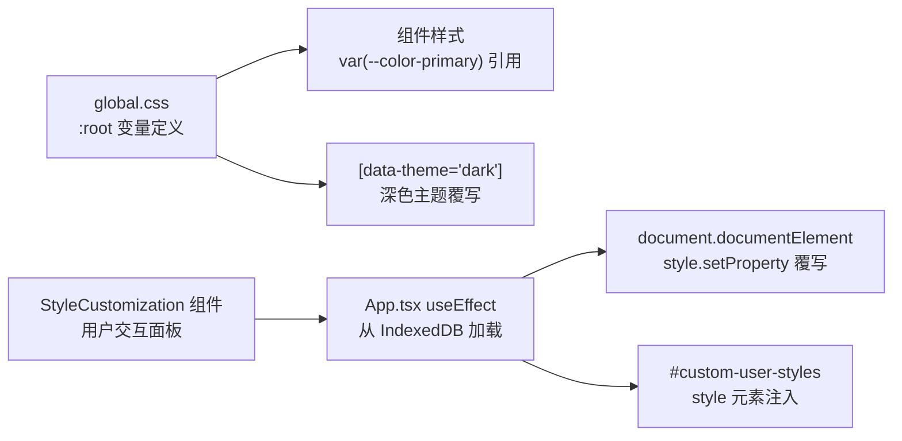

以下是 Wiki 页面正文：

---

# CSS 变量主题系统与样式自定义

Moe Translate 的主题系统围绕 CSS 自定义属性（CSS Variables）构建，所有 UI 组件的颜色、排版、间距、圆角、阴影和动画时长都由 `:root` 上的变量统一驱动。这套系统使得「样式自定义」不再需要重写组件样式，而是通过覆写变量值即可实现全局换肤。

---

## 架构概览

主题系统分为三个层级，从底层定义到用户交互依次为：



**核心思想**：样式变量在 `:root` 上用 CSS 自定义属性声明，所有组件通过 `var(...)` 引用。深色模式通过属性选择器 `[data-theme='dark']` 批量覆写颜色变量。用户自定义样式通过 JavaScript 运行时注入，并持久化到 IndexedDB。[来源](../src/styles/global.css#L1-L35)

---

## CSS 变量全集

`global.css` 在 `:root` 中定义了约 40 个变量，分为 7 个类别。

### 1. 颜色体系

颜色变量是主题系统的核心，决定了应用的整体视觉基调：

```css
:root {
  --color-primary: #0f30e0;        /* 主色：按钮、链接、焦点边框 */
  --color-primary-hover: #0a25b8;  /* 主色悬停态 */
  --color-bg: #ffffff;             /* 页面主背景 */
  --color-bg-secondary: #f7f9fc;   /* 次级背景：面板头部、输入框 */
  --color-bg-tertiary: #eef1f8;    /* 三级背景：悬停高亮 */
  --color-border: #dfe3ef;         /* 边框色 */
  --color-border-focus: #0f30e0;   /* 焦点态边框 */
  --color-text: #1a1a2e;           /* 主文字色 */
  --color-text-secondary: #6b7280; /* 次要文字色 */
  --color-text-placeholder: #9ca3af; /* 占位文字色 */
  --color-success: #10b981;        /* 成功态（绿色） */
  --color-error: #ef4444;          /* 错误态（红色） */
  --color-warning: #f59e0b;        /* 警告态（黄色） */
}
```

应用中的每个有颜色的元素都引用这些变量——按钮用 `var(--color-primary)`，背景用 `var(--color-bg)`，边框用 `var(--color-border)`。这意味着修改一个变量就能影响所有使用它的组件。[来源](../src/styles/global.css#L1-L14)

### 2. 排版

```css
:root {
  --font-family: -apple-system, BlinkMacSystemFont, 'Segoe UI', Roboto,
    'Helvetica Neue', Arial, sans-serif;
  --font-size-xs: 0.75rem;   /* 12px */
  --font-size-sm: 0.875rem;  /* 14px */
  --font-size-base: 1rem;    /* 16px */
  --font-size-lg: 1.125rem;  /* 18px */
  --font-size-xl: 1.25rem;   /* 20px */
  --font-size-2xl: 1.5rem;   /* 24px */
}
```

[来源](../src/styles/global.css#L16-L24)

### 3. 间距

间距变量定义了一套 8 点网格系统（0.25rem = 4px 为基准单位）：

| 变量 | 值 | 对应像素 |
|------|----|---------|
| `--spacing-1` | 0.25rem | 4px |
| `--spacing-2` | 0.5rem | 8px |
| `--spacing-3` | 0.75rem | 12px |
| `--spacing-4` | 1rem | 16px |
| `--spacing-5` | 1.25rem | 20px |
| `--spacing-6` | 1.5rem | 24px |
| `--spacing-8` | 2rem | 32px |

[来源](../src/styles/global.css#L26-L34)

### 4. 圆角

```css
--radius-sm: 0.25rem;   /* 4px - 小元素 */
--radius-md: 0.5rem;    /* 8px - 卡片、按钮 */
--radius-lg: 0.75rem;   /* 12px - 大面板 */
--radius-full: 9999px;  /* 圆形 - 头像、标签 */
```

[来源](../src/styles/global.css#L36-L40)

### 5. 阴影

```css
--shadow-sm: 0 1px 2px 0 rgb(0 0 0 / 0.05);   /* 轻阴影 */
--shadow-md: 0 4px 6px -1px rgb(0 0 0 / 0.1); /* 中等阴影 */
--shadow-lg: 0 10px 15px -3px rgb(0 0 0 / 0.1); /* 重阴影 */
```

[来源](../src/styles/global.css#L42-L46)

### 6. 过渡时长

```css
--transition-fast: 150ms ease;   /* 悬停、焦点等微交互 */
--transition-normal: 200ms ease; /* 一般动画 */
--transition-slow: 300ms ease;   /* 面板弹出等较大变化 */
```

[来源](../src/styles/global.css#L48-L52)

### 7. Z-index 层级

```css
--z-dropdown: 100;  /* 下拉菜单 */
--z-modal: 200;     /* 模态框 */
--z-toast: 300;     /* Toast 提示 */
```

[来源](../src/styles/global.css#L54-L58)

---

## 深色主题机制

深色主题不依赖 JavaScript，而是通过 `[data-theme='dark']` CSS 属性选择器实现。当 `<html>` 元素上出现 `data-theme="dark"` 属性时，浏览器自动应用深色覆写块中的变量值：

```css
[data-theme="dark"] {
  --color-primary: #5b8af0;        /* 更亮的蓝色适配深色背景 */
  --color-primary-hover: #7aa3f5;
  --color-bg: #1a1a2e;             /* 深蓝黑主背景 */
  --color-bg-secondary: #252540;   /* 略浅的次级背景 */
  --color-bg-tertiary: #2d2d4a;
  --color-border: #3d3d5c;
  --color-border-focus: #5b8af0;
  --color-text: #f3f4f6;           /* 浅色文字 */
  --color-text-secondary: #9ca3af;
  --color-text-placeholder: #6b7280;
}
```

**关键设计决策**：深色主题只覆写颜色变量，间距、圆角、阴影等结构变量保持不变。这意味着切换主题时布局不会「跳动」，浏览器只需重新计算颜色值即可完成切换，零 JavaScript 开销。

非颜色变量（排版、间距、圆角、阴影、过渡、z-index）在 `[data-theme='dark']` 中不做覆写，因为它们与视觉主题无关。[来源](../src/styles/global.css#L60-L72)

---

## 样式加载与持久化

用户自定义样式的生命周期由 `App.tsx` 中的一个 `useEffect` 管理：

```typescript
useEffect(() => {
  const loadSavedStyles = async () => {
    const savedVars = await getSetting('cssVariables');
    const savedCSS = await getSetting('customCSS');

    if (savedVars && typeof savedVars === 'object') {
      const vars = savedVars as Record<string, string>;
      const root = document.documentElement;
      for (const [key, value] of Object.entries(vars)) {
        root.style.setProperty(key, value);
      }
    }

    if (typeof savedCSS === 'string' && savedCSS) {
      let customStyleEl = document.getElementById('custom-user-styles');
      if (!customStyleEl) {
        customStyleEl = document.createElement('style');
        customStyleEl.id = 'custom-user-styles';
        document.head.appendChild(customStyleEl);
      }
      customStyleEl.textContent = savedCSS;
    }
  };
  loadSavedStyles();
}, []);
```

这段代码执行两条路径：

1. **CSS 变量路径**：从 IndexedDB 的 `settings` object store 读取 `cssVariables`（类型为 `Record<string, string>`），然后逐条调用 `document.documentElement.style.setProperty(key, value)` 覆写 `:root` 上的变量。由于 CSS 自定义属性的层叠特性，内联样式优先级高于 `:root` 规则，因此能覆盖 `global.css` 中的默认值。

2. **自定义 CSS 路径**：从 IndexedDB 读取 `customCSS`（纯文本字符串），查找或创建 `<style id="custom-user-styles">` 元素，将其 `textContent` 设为用户输入的自定义 CSS。这个 style 元素位于 `<head>` 末尾，其声明的规则优先级高于 `global.css`。

这两个数据字段定义在 `AppSettings` 接口中：[来源](../src/lib/db.ts#L50-L51)

```typescript
export interface AppSettings {
  cssVariables?: Record<string, string>;
  customCSS?: string;
  // ...
}
```

[来源](../src/App.tsx#L144-L169) | [来源](../src/lib/db.ts#L34-L55)

---

## StyleCustomization 组件

`StyleCustomization` 组件为用户提供了一个图形化界面来操作上述机制。它作为一个模态面板，从顶部导航栏的调色板图标触发打开。

组件内部维护两个状态：`cssVariables`（15 个精选变量）和 `customCSS`（原始 CSS 文本），并分为三个选项卡。

### 基础面板（Basic）

基础面板提供无需 CSS 知识的可视化编辑体验：

**预设选择器（Presets）**：三个一键切换的预设：

| 预设 | 适用场景 | 主色 | 背景色 |
|------|---------|------|--------|
| **Light** | 默认浅色主题 | `#0f30e0` | `#ffffff` |
| **Dark** | 暗色偏好用户 | `#6366f1` | `#0f0f0f` |
| **Purple** | 紫色调主题 | `#8b5cf6` | `#faf5ff` |

点击预设按钮会将所有变量替换为预设值。

**颜色选择器网格**：10 个核心颜色变量以「颜色拾取器 + 文本输入」的双控件形式展示。用户既可以用原生 `<input type="color">` 直观选色，也可以直接在文本框中输入十六进制值。

**实时预览卡片**：一个内嵌的预览区域动态应用当前变量值，包含一个主色按钮和次要文字样本，让用户在保存前看到效果。

### 高级面板（Advanced）

面向有 CSS 经验的用户，提供一个 `<textarea>` 用于输入任意 CSS 代码。这里输入的 CSS 会通过上面描述的 `#custom-user-styles` style 元素注入到页面中。面板底部附有示例代码和提示。

### 文档面板（Docs）

文档面板将 `src/styles/custom-docs.md` 中的内容以交互式表格的形式内联呈现，列出所有可用的 CSS 变量名、默认值和描述。用户无需离开应用即可查阅完整变量文档。

### 应用与持久化

当用户点击 **Apply** 按钮时：

1. `saveSetting('cssVariables', ...)` 将当前变量状态写入 IndexedDB
2. `saveSetting('customCSS', ...)` 将自定义 CSS 文本写入 IndexedDB
3. 在内存中调用 `applyStyles()` 函数，立即将变量写入 `document.documentElement.style`、将 CSS 注入 `#custom-user-styles`

**Reset** 按钮将变量恢复为 `DEFAULT_VARIABLES`、清空自定义 CSS，并即时应用。

[来源](../src/components/StyleCustomization/StyleCustomization.tsx#L111-L381) | [来源](../src/components/StyleCustomization/StyleCustomization.css)

---

## 内置文档文件

`src/styles/custom-docs.md` 是一份独立的 Markdown 文档，详细记录了所有 CSS 变量的含义和自定义示例。StyleCustomization 组件的 Docs 面板直接引用了这份文档的内容。该文档涵盖了：

- 每个变量分类的中文说明
- 自定义主色、深色主题、圆角、字体的完整示例代码
- 组件级样式覆写的技巧

这份文档随源码分发，既可作为开发参考，也可作为 StyleCustomization 面板中的内联帮助。[来源](../src/styles/custom-docs.md)

---

## 与组件样式的关系

所有 UI 组件在声明样式时都通过 `var(--variable-name)` 引用上述变量，而非硬编码值。例如 `App.css` 中的典型写法：

```css
.app-header {
  background: var(--color-bg);
  border-bottom: 1px solid var(--color-border);
}

.tab-btn.active {
  color: var(--color-primary);
}

.translate-btn {
  background: var(--color-primary);
}
.translate-btn:hover:not(:disabled) {
  background: var(--color-primary-hover);
}
```

这种设计保证了「修改变量 = 修改整个应用的外观」，无需逐个组件排查硬编码颜色值。[来源](../src/App.css#L12-L19)

---

## 推荐阅读

- [界面导览与核心操作](界面导览与核心操作.md) —— 了解顶部导航栏中的样式自定义入口位置
- [IndexedDB 数据层设计](indexeddb-数据层设计.md) —— 深入 `settings` object store 的读写机制
- [状态管理：Zustand 与持久化策略](状态管理-zustand-与持久化策略.md) —— 理解 `AppSettings` 如何与 Zustand store 协同
- [构建工具链与配置](构建工具链与配置.md) —— Vite CSS 处理管线如何编译 `global.css`