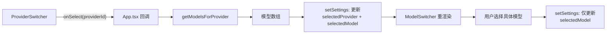
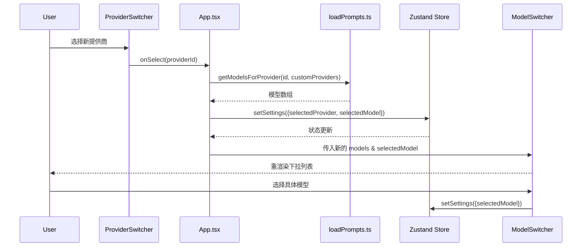

现在我已经收集了所有关键代码，可以撰写页面了。

---

# ProviderSwitcher 与 ModelSwitcher 联动机制

当你切换 LLM 提供商时，应用需要立刻加载该提供商支持的模型列表，并自动选中第一个模型作为当前模型。这个"切换提供商 → 刷新模型列表 → 默认选中首个模型"的三步流程，就是 **ProviderSwitcher 与 ModelSwitcher 联动机制** 的核心。本文将深入解析这一联动机制的实现细节，包括自定义提供商的动态注册，以及每个提供商独立存储 API 密钥的设计。

## 一、整体架构：以 App.tsx 为编排中心

联动机制涉及三个角色：



- **ProviderSwitcher** 和 **ModelSwitcher** 都是纯展示组件（dumb components），它们只负责渲染 `<select>` 下拉框和抛出事件。
- **App.tsx** 是编排者，负责组装数据、处理回调、更新全局状态。
- **`getModelsForProvider()`** 是数据查询函数，承担"根据提供商 ID 返回对应模型列表"的职责。

[来源](App.tsx#L507-L518)

## 二、ProviderSwitcher：合并内置与自定义提供商

### 2.1 allProviders 数组的构建

在 App.tsx 的函数体顶部，`allProviders` 数组由两部分拼接而成：

```typescript
const builtInProviders = getBuiltInProviders();
const customProviders = safeSettings.customProviders;
const allProviders = [
  ...Object.entries(builtInProviders).map(([id, p]) => ({
    id,
    name: p.name,
    isBuiltIn: true
  })),
  ...customProviders.map(p => ({
    id: p.id,
    name: p.name,
    isBuiltIn: false
  }))
];
```

这里的两个数据来源：
- **`getBuiltInProviders()`** 读取 `prompts.yaml` 中预定义的提供商（DeepSeek、OpenAI、Anthropic 等），返回 `Record<string, BuiltInProvider>`。
- **`customProviders`** 来自 Zustand store 中 `settings.customProviders`，是用户在设置面板中动态添加的。

每个条目都有一个 `isBuiltIn` 标记，供 UI 区分显示——自定义提供商在选项中会附加 `(Custom)` 后缀。

[来源](App.tsx#L80-L97)

### 2.2 ProviderSwitcher 组件

组件的 props 极简：

```typescript
interface ProviderSwitcherProps {
  currentProvider: string;
  providers: ProviderOption[];
  onSelect: (providerId: string) => void;
}
```

当用户切换时，`onSelect(providerId)` 被触发，控制权交回 App.tsx。当 `providers` 为空数组时，组件返回 `null`，不渲染任何内容。

[来源](components/ProviderSwitcher/ProviderSwitcher.tsx#L10-L32)

## 三、核心联动：onSelect 三步曲

ProviderSwitcher 的 `onSelect` 回调是联动机制的心脏：

```typescript
onSelect={(providerId) => {
  const newModels = getModelsForProvider(providerId, customProviders);
  const newModel = newModels.length > 0 ? newModels[0].id : '';
  useAppStore.getState().setSettings({
    selectedProvider: providerId,
    selectedModel: newModel
  });
}}
```

三步逻辑清晰分明：

1. **获取模型列表**：调用 `getModelsForProvider(providerId, customProviders)`，传入新选的提供商 ID 和当前所有自定义提供商数组。
2. **默认选中第一个模型**：如果模型列表非空，取第一个模型的 `id`；否则设为空字符串。
3. **批量更新状态**：通过 `setSettings` **同时**更新 `selectedProvider` 和 `selectedModel`。这里的关键设计是——两个字段在一次 setState 调用中完成，确保 UI 不会出现"提供商已切换但模型还未更新"的中间状态。

相比之下，ModelSwitcher 的 `onSelect` 只更新 `selectedModel`，因为它只需要改变模型，与提供商无关。

[来源](App.tsx#L511-L517)

### 3.1 getModelsForProvider 的查询逻辑

```typescript
export function getModelsForProvider(providerId, customProviders) {
  const builtInProviders = getBuiltInProviders();
  // 先查内置
  if (builtInProviders[providerId]) {
    return builtInProviders[providerId].models.map(m => ({
      id: m.id,
      name: m.name,
      supportsThinking: m.supports_thinking,
      maxContext: m.max_context
    }));
  }
  // 再查自定义
  const customProvider = customProviders.find(p => p.id === providerId);
  if (customProvider) {
    return customProvider.models;
  }
  return [];
}
```

该函数先查内置提供商字典，再查自定义数组，最终返回统一的模型格式 `{ id, name, supportsThinking, maxContext }`。如果都没找到（比如用户删除了一个自定义提供商但 store 中尚未同步），返回空数组。

[来源](lib/prompts/loadPrompts.ts#L471-L488)

## 四、ModelSwitcher：渲染模型列表与能力标记

### 4.1 模型数据的转换管道

在 App.tsx 中，`getModelsForProvider` 返回的数组被转换为 ModelSwitcher 所需的 `Record` 格式：

```typescript
const currentProviderModels = getModelsForProvider(safeSettings.selectedProvider, customProviders);
const models = Object.fromEntries(
  currentProviderModels.map(m => [m.id, { name: m.name, supports_thinking: m.supportsThinking }])
);
```

这种转换将数组变为以模型 ID 为键的字典，方便 ModelSwitcher 做 O(1) 查找。

[来源](App.tsx#L99-L102)

### 4.2 模型能力的视觉标记

ModelSwitcher 的每个选项会附加一个表情符号标识：

```typescript
{model.supports_thinking ? ' 🤖' : ''}
```

🤖 图标表示该模型支持思考链（reasoning）能力，对应 API 响应中的 `reasoning_content` 字段。这一标记与 [思考链（Thinking Chain）展示组件](思考链-thinking-chain-展示组件.md) 中描述的流式渲染机制直接关联——只有标记了 🤖 的模型才会触发思考内容的实时渲染。

当模型列表为空时，ModelSwitcher 渲染一个禁用的 `<select>`，显示 "No models available"。

[来源](components/ModelSwitcher/ModelSwitcher.tsx#L15-L43)

## 五、Settings 面板：自定义提供商与模型的动态管理

Settings.tsx 是用户添加/删除自定义提供商和模型的管理界面。核心状态变化都发生在保存前的本地状态中，只有点击"保存"按钮后才会写回 Zustand store 并持久化到 IndexedDB。

### 5.1 添加自定义提供商

```typescript
const handleAddCustomProvider = () => {
  const provider: CustomProvider = {
    id: `custom_${Date.now()}`,
    name: newProviderName.trim(),
    baseUrl: newProviderBaseUrl.trim(),
    models: []
  };
  setCustomProviders([...customProviders, provider]);
};
```

每个自定义提供商通过 `Date.now()` 生成唯一 ID，初始模型列表为空。添加后，用户需要先选中该提供商，再逐个添加模型。

[来源](components/Settings/Settings.tsx#L119-L131)

### 5.2 删除自定义提供商

```typescript
const handleRemoveCustomProvider = (id: string) => {
  setCustomProviders(customProviders.filter(p => p.id !== id));
  const newKeys = { ...providerApiKeys };
  delete newKeys[id];
  setProviderApiKeys(newKeys);
  if (selectedProvider === id) {
    setSelectedProvider('deepseek');
    setSelectedModel('deepseek-v4-flash');
  }
};
```

删除时执行三个清理动作：
- 从 `customProviders` 数组中移除
- 从 `providerApiKeys` 中删除对应的密钥
- 如果当前选中的就是被删除的提供商，回退到默认的 DeepSeek 及其默认模型

[来源](components/Settings/Settings.tsx#L133-L140)

### 5.3 添加模型到指定提供商

```typescript
const handleAddCustomModel = () => {
  const model: CustomModel = {
    id: newModelId.trim(),
    name: newModelName.trim(),
    maxContext: parseInt(newModelMaxContext) || 128000,
    supportsThinking: newModelSupportsThinking
  };
  setCustomProviders(
    customProviders.map(p => {
      if (p.id === selectedProvider) {
        return { ...p, models: [...p.models, model] };
      }
      return p;
    })
  );
};
```

模型通过 `selectedProvider` 确定归属，`maxContext` 默认 128000，`supportsThinking` 是一个可选的复选框。这一设计使得用户可以自由组合任何兼容 OpenAI API 格式的模型。

[来源](components/Settings/Settings.tsx#L156-L172)

### 5.4 删除模型

```typescript
const handleRemoveCustomModel = (modelId: string) => {
  setCustomProviders(
    customProviders.map(p => {
      if (p.id === selectedProvider) {
        return { ...p, models: p.models.filter(m => m.id !== modelId) };
      }
      return p;
    })
  );
  if (selectedModel === modelId) {
    const models = getModelsForProvider(selectedProvider, customProviders);
    if (models.length > 0) {
      setSelectedModel(models[0].id);
    }
  }
};
```

删除当前选中的模型时，自动回退到该提供商下的第一个可用模型，防止出现"选中一个已被删除的模型"状态。

[来源](components/Settings/Settings.tsx#L174-L190)

## 六、providerApiKeys：每个提供商独立存储

API 密钥的管理采用了**以提供商 ID 为键**的 `Record<string, string>` 结构：

```typescript
// AppSettings 接口中的定义
providerApiKeys: Record<string, string>;

// 默认为空对象
providerApiKeys: {},
```

### 6.1 密钥的存取机制

在 Settings 面板中，API 密钥输入框的值绑定到当前选中的提供商：

```typescript
<input
  type="password"
  value={providerApiKeys[selectedProvider] || ''}
  onChange={e => setProviderApiKeys({ ...providerApiKeys, [selectedProvider]: e.target.value })}
/>
```

切换提供商时，输入框自动显示该提供商已保存的密钥（如果有），或者显示空值。这意味着你可以在不同提供商之间使用完全不同的 API 密钥，互不干扰。

[来源](components/Settings/Settings.tsx#L72-L79)

### 6.2 密钥的持久化与迁移

`saveSettingsToDb()` 将整个 `providerApiKeys` 对象序列化到 IndexedDB 的 `settings` object store 中。从旧版本迁移时，`loadSettingsFromDb()` 会处理一个兼容逻辑：

```typescript
providerApiKeys: dbSettings.providerApiKeys || 
  ((dbSettings as any).apiKey ? { deepseek: (dbSettings as any).apiKey } : {}),
```

这保证了早期只支持单一 API 密钥的用户数据不会丢失——旧字段 `apiKey` 会被自动包装为 `{ deepseek: oldKey }` 的格式。

[来源](hooks/useAppStore.ts#L238-L239)

## 七、数据流全景



这个序列图清晰展示了两个操作分支：
- **上半部分（切换提供商）**：三步联动，批量更新两个字段。
- **下半部分（选择模型）**：一步直达，只更新模型字段。

## 八、与文档翻译组件的联动

值得注意的是，[文档翻译组件](long-text-与文档翻译的分段策略.md) 也有自己独立的提供商和模型查询逻辑。在 `DocumentTranslation.tsx` 中，同样调用 `getModelsForProvider(settings.selectedProvider, customProviders)` 来获取模型列表，确保相同的提供商选择在主翻译界面和文档翻译界面之间保持一致。

[来源](components/DocumentTranslation/DocumentTranslation.tsx#L100)

## 核心设计原则回顾

1. **展示与逻辑分离**：ProviderSwitcher 和 ModelSwitcher 只做渲染和事件上报，所有编排逻辑集中在 App.tsx。
2. **批量状态更新**：切换提供商时同时更新 `selectedProvider` 和 `selectedModel`，消除中间态。
3. **两级回退保护**：删除提供商回退到 DeepSeek，删除模型回退到该提供商第一个模型，保证 UI 不会出现空选状态。
4. **每提供商独立密钥**：`providerApiKeys` 的 Record 结构天然支持多密钥管理，且兼容旧版单一密钥的迁移。

## 推荐阅读

- [API 密钥与提供商配置](api-密钥与提供商配置.md) —— 完整的提供商列表、定价信息与密钥配置说明。
- [状态管理：Zustand 与持久化策略](状态管理-zustand-与持久化策略.md) —— 深入了解 `setSettings` 背后的 Zustand persist 机制与 IndexedDB 持久化流程。
- [思考链（Thinking Chain）展示组件](思考链-thinking-chain-展示组件.md) —— 了解 `supports_thinking` 标记如何与流式推理展示联动。