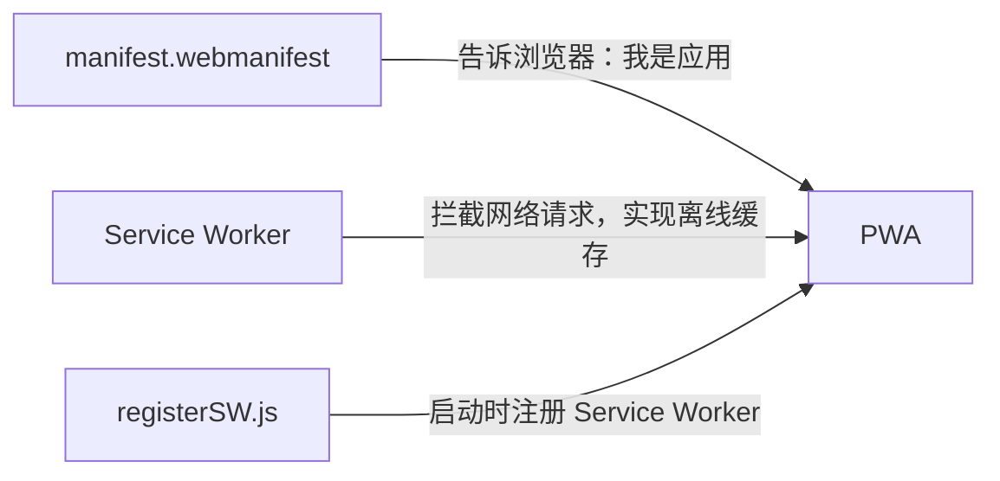

# PWA 安装与离线使用

Moe Translate 不仅仅是一个网页——它是一个 **PWA（渐进式 Web 应用）**。这意味着你可以像安装普通软件一样，把它"装"到你的电脑或手机桌面上，甚至在没网的时候也能打开使用。本节带你从代码层面到操作层面，彻底理解这一切是如何工作的。

---

## PWA 的三大核心要素

一个网页要想成为 PWA，必须满足三个条件。Moe Translate 全部做到了：



### 1. manifest.webmanifest —— 应用的"身份证"

这个 JSON 文件告诉浏览器："我不仅仅是一个网页，我是一个可以独立运行的应用程序"。它在构建时由 `vite-plugin-pwa` 自动生成，最终出现在网站的根目录下。

打开 `dist/manifest.webmanifest`，你会看到：

```json
{
  "name": "Moe Translate",
  "short_name": "Translate",
  "display": "standalone",
  "start_url": "/",
  "scope": "/",
  "icons": [
    { "src": "app-icon-192.png", "sizes": "192x192", "type": "image/png" },
    { "src": "app-icon-512.png", "sizes": "512x512", "type": "image/png" }
  ]
}
```

关键字段解释：

| 字段 | 作用 |
|------|------|
| `name` / `short_name` | 应用的全名和桌面快捷方式名 |
| `display: standalone` | 安装后打开时**没有浏览器地址栏**，像原生应用 |
| `scope: "/"` | 应用的作用域是整个站点 |
| `icons` | 桌面图标的不同尺寸版本 |

这个 manifest 文件通过 `index.html` 中的 `<link rel="manifest" href="/manifest.webmanifest" />` 被浏览器发现。 [来源](vite.config.ts#L8-L43) | [来源](index.html#L11-L11)

### 2. Service Worker —— 离线的幕后英雄

**Service Worker** 是一个独立于网页的 JavaScript 文件，它在后台运行，拦截所有网络请求。Moe Translate 的 Service Worker 由 Workbox（Google 出品的 Service Worker 工具库）自动生成。

在 `vite.config.ts` 中，`workbox` 配置定义了缓存策略：

```typescript
workbox: {
  globPatterns: ['**/*.{js,css,html,ico,png,svg,woff2}'],
  runtimeCaching: [
    {
      urlPattern: /^https:\/\/fonts\.googleapis\.com\/.*/i,
      handler: 'CacheFirst',
      options: {
        cacheName: 'google-fonts-cache',
        expiration: { maxEntries: 10, maxAgeSeconds: 60 * 60 * 24 * 365 }
      }
    }
  ]
}
```

这里有两个层次的缓存：

- **预缓存（Precache）**：`globPatterns` 匹配的所有静态资源（JS、CSS、HTML、图片等），在 Service Worker 安装时一次性下载到本地。
- **运行时缓存（Runtime Caching）**：对于 Google Fonts 这类外部资源，采用 **CacheFirst** 策略——首次访问时从网络获取并缓存，之后直接从缓存读取。缓存有效期长达一年。

这两条 Google Fonts 的缓存规则（`fonts.googleapis.com` 和 `fonts.gstatic.com`）确保应用的字体样式在离线时仍然完整。 [来源](vite.config.ts#L44-L77)

### 3. registerSW.js —— 启动注册

要让 Service Worker 开始工作，网页需要在加载时注册它。`dist/registerSW.js` 只有几行代码：

```javascript
if('serviceWorker' in navigator) {
  window.addEventListener('load', () => {
    navigator.serviceWorker.register('/sw.js', { scope: '/' })
  })
}
```

逻辑很简单：**先检查浏览器是否支持 Service Worker**（`'serviceWorker' in navigator`），然后在页面加载完成后注册 `sw.js`，作用域为整个站点。 `registerType: 'autoUpdate'` 的配置意味着当新版本发布时，Service Worker 会自动更新，无需用户手动操作。 [来源](dist/registerSW.js#L1) | [来源](vite.config.ts#L9-L9)

这三个要素通过 `index.html` 串联在一起：manifest 通过 `<link>` 标签引入，而 `registerSW.js` 由 `vite-plugin-pwa` 在构建时自动注入到 HTML 中。 [来源](index.html#L11-L11)

---

## 如何安装 Moe Translate

准备工作：确保你的 Moe Translate 已经部署到线上（比如 Cloudflare Pages），或者正运行在本地开发服务器上。

**在 Chrome 或 Edge 中安装：**

1. 打开 Moe Translate 网站。
2. 观察地址栏右侧——你会看到一个 **安装图标**（一个带+号的电脑图标💻）。点击它。
3. 在弹出的对话框中点击 **"安装"**。
4. 应用会自动打开一个独立的窗口，没有地址栏，没有标签页——它现在就是一个真正的桌面应用了！

> 如果在地址栏没看到安装按钮，可以点击浏览器右上角的菜单（三个点），选择 **"安装 Moe Translate"** 或 **"将此站点作为应用安装"**。

安装完成后，你会在桌面（或开始菜单/应用抽屉）看到 Moe Translate 的图标，双击即可打开。

---

## 飞行模式体验：离线查看翻译历史

安装完成后，来试试它的离线能力：

1. **先在有网络时做几次翻译**，这样缓存中就有了静态资源，历史记录也保存在本地 IndexedDB 中。
2. **开启飞行模式**（或在电脑上断开 Wi-Fi / 拔掉网线）。
3. 双击桌面上的 Moe Translate 图标打开应用。
4. 你会看到：**应用正常启动！** 界面完整呈现，没有"404"或"无法连接"的报错。
5. 点击左下角的历史按钮（时钟图标⏰），**之前翻译过的记录仍然可以查看**。

这是因为：
- 应用的 HTML、CSS、JavaScript、图标等**静态资源**已通过 Service Worker 预缓存到本地。
- 翻译历史数据存储在浏览器的 **IndexedDB** 数据库中（详见 [IndexedDB 数据层设计](indexeddb-数据层设计.md)），完全独立于网络。

---

## ⚠️ 重要提醒：离线 ≠ 全功能

虽然 Moe Translate 在离线时可以打开并查看历史，但 **翻译功能本身需要网络连接**。

当你在离线状态下尝试翻译时，界面会提示 `Please configure your API key` 或请求失败——这是因为翻译请求需要调用远程的 LLM API（如 DeepSeek、OpenAI 等），**API 请求无法被 Service Worker 缓存**。Service Worker 只缓存了你应用自身的静态资源（JS、CSS、图片），而不是 API 的响应结果。

简单说：

| 能力 | 在线 | 离线 |
|------|------|------|
| 打开应用 | ✅ | ✅（静态资源已缓存） |
| 查看历史翻译 | ✅ | ✅（数据在 IndexedDB） |
| 执行新翻译 | ✅ | ❌（需要调用 API） |
| Google Fonts 字体 | ✅ | ✅（已缓存一年） |

---

## 进一步了解

- [离线策略与性能优化](离线策略与性能优化.md) —— 深入分析 Workbox 的缓存策略细节和性能调优
- [构建工具链与配置](构建工具链与配置.md) —— 了解 vite-plugin-pwa 在整个构建管线中的位置
- [Cloudflare Pages 部署指南](cloudflare-pages-部署指南.md) —— 部署后别忘了检查 `_headers` 中的 Service Worker 缓存控制