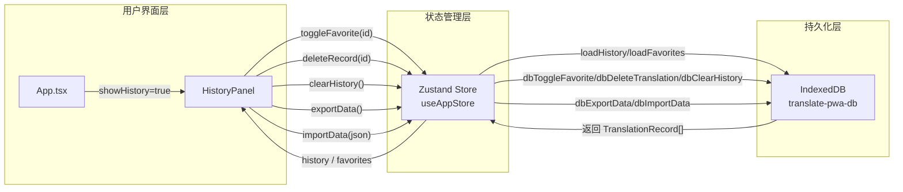

现在所有关键代码已就绪，我来撰写 Wiki 页面。

---

# 历史面板与数据管理

## 概览

**HistoryPanel** 是 Moe Translate 的用户数据管理中心，以侧边面板形式展示所有翻译记录。它同时承担了**浏览**、**搜索**、**收藏**、**删除**、**导入导出**和**数据回溯**六项职责。整个数据链路贯通了三层架构：IndexedDB 做持久存储、Zustand Store 做内存缓存与状态同步、React 组件做渲染与交互。

[状态管理：Zustand 与持久化策略](状态管理-zustand-与持久化策略.md) 中详细分析了 Store 的 persist 配置，本文聚焦于 HistoryPanel 组件本身及其与数据层的交互模式。

[来源](../src/components/HistoryPanel/HistoryPanel.tsx#L1-L13)

---

## 组件入口与显示控制

HistoryPanel 的显隐受 `App.tsx` 中 `showHistory` 布尔状态控制：

```tsx
// App.tsx
{showHistory && (
  <HistoryPanel onClose={() => setShowHistory(false)} />
)}
```

`showHistory` 的切换入口有两处：桌面端的**顶部工具栏历史按钮**和移动端的**更多菜单项**。两者都调用 `setShowHistory(!showHistory)`，实现开关式切换。

[来源](../src/App.tsx#L661-L663)

[来源](../src/App.tsx#L539-L539)

[来源](../src/App.tsx#L582-L582)

HistoryPanel 本身接收一个 `onClose` 回调，通过点击遮罩层或关闭按钮触发关闭。面板使用 `e.stopPropagation()` 防止点击内容区冒泡关闭，这是**模态面板**的经典模式。

[来源](../src/components/HistoryPanel/HistoryPanel.tsx#L7-L10)

[来源](../src/components/HistoryPanel/HistoryPanel.tsx#L54-L55)

---

## 数据获取与双标签结构

组件从 `useAppStore` 解构出两个核心列表和一个搜索关键词：

```tsx
const { history, favorites, ... } = useAppStore();
const [activeTab, setActiveTab] = useState<TabType>('history');
const [searchQuery, setSearchQuery] = useState('');
const currentList = activeTab === 'history' ? history : favorites;
```

面板顶部提供两个标签页——**历史记录**和**收藏夹**，各自显示对应列表的长度计数：

```tsx
<button className={`tab-btn ${activeTab === 'history' ? 'active' : ''}`}>
  {`${t('history.history')} (${history.length})`}
</button>
<button className={`tab-btn ${activeTab === 'favorites' ? 'active' : ''}`}>
  {`${t('history.favorites')} (${favorites.length})`}
</button>
```

两个列表的数据来源是 Zustand Store 中通过 `loadHistory` / `loadFavorites` 异步填充的内存数组。这些数组在 Store 初始化时为空，应用启动后由 `onRehydrateStorage` 回调触发加载。具体的 IndexedDB 读取逻辑在 [IndexedDB 数据层设计](indexeddb-数据层设计.md) 中有完整说明。

[来源](../src/components/HistoryPanel/HistoryPanel.tsx#L16-L24)

[来源](../src/components/HistoryPanel/HistoryPanel.tsx#L68-L80)

[来源](../src/hooks/useAppStore.ts#L201-L211)

---

## 本地搜索过滤

搜索是纯客户端过滤，不涉及数据库查询。filter 条件检查 `sourceText` 和 `targetText` 是否包含用户输入（忽略大小写）：

```tsx
const filteredList = currentList.filter(record =>
  record.sourceText.toLowerCase().includes(searchQuery.toLowerCase()) ||
  record.targetText.toLowerCase().includes(searchQuery.toLowerCase())
);
```

值得注意的是，搜索范围局限在当前激活的标签页列表（`currentList`）内，这意味着**收藏夹标签页下不会搜索到非收藏记录**。

[来源](../src/components/HistoryPanel/HistoryPanel.tsx#L26-L29)

---

## 记录操作：收藏、删除、回溯

### 收藏/取消收藏

每条记录右侧有一个星形按钮，点击调用 `toggleFavorite(record.id)`。按钮的 `fill` 属性根据 `record.isFavorite` 动态切换——实心星表示已收藏，空心星表示未收藏。

```tsx
<button onClick={() => record.id && toggleFavorite(record.id)}>
  <svg fill={record.isFavorite ? 'currentColor' : 'none'} ...>
```

Store 层的 `toggleFavorite` 委托给 `db.ts` 中的同名函数：先 `store.get(id)` 取出现有记录，取反 `isFavorite` 字段，再 `store.put` 写回。操作完成后刷新 `history` 和 `favorites` 两个列表。

[来源](../src/components/HistoryPanel/HistoryPanel.tsx#L140-L155)

[来源](../src/lib/db.ts#L176-L194)

[来源](../src/hooks/useAppStore.ts#L224-L228)

### 删除单条记录

删除按钮调用 `deleteRecord(record.id)`，同样在 IDB 操作完成后刷新双列表。

[来源](../src/components/HistoryPanel/HistoryPanel.tsx#L156-L165)

[来源](../src/lib/db.ts#L128-L138)

[来源](../src/hooks/useAppStore.ts#L230-L235)

### 回溯记录到主界面

点击记录的源文本区域会触发 `handleSelectRecord`，将所有字段回填到主界面的输入区：

```tsx
const handleSelectRecord = (record) => {
  setSourceText(record.sourceText);
  setTargetText(record.targetText);
  setSourceLang(record.sourceLang);
  setTargetLang(record.targetLang);
  setMode(record.mode);
  if (record.style) setStyle(record.style);
  onClose();
};
```

这实际上是**一键恢复**功能：点击历史记录即可将其「加载」到编辑器，继续编辑或重新翻译。注意 `targetText` 也被回填，这使用户可以直接查看或复制上次的翻译结果。

[来源](../src/components/HistoryPanel/HistoryPanel.tsx#L31-L39)

---

## 数据导入与导出

### 导出为 JSON

`handleExport` 调用 `exportData()`，该函数在 `db.ts` 中组合了全部历史记录和设置：

```ts
export async function exportData(): Promise<string> {
  const history = await getAllHistory();
  const settings = await getAllSettings();
  return JSON.stringify({ history, settings }, null, 2);
}
```

返回的 JSON 字符串通过 Blob 创建下载链接，文件名带时间戳：`translate-history-{timestamp}.json`。

[来源](../src/components/HistoryPanel/HistoryPanel.tsx#L41-L51)

[来源](../src/lib/db.ts#L276-L281)

### 导入 JSON

`handleImport` 使用隐藏的 `<input type="file">` 触发文件选择，读取文件内容后调用 `importData(text)`。

导入函数解析 JSON，分两步写入：
1. **历史记录**：遍历 `data.history` 数组，移除每条记录的 `id` 字段（让 IndexedDB 自动生成新 ID），逐条 `store.add`。
2. **设置**：遍历 `data.settings` 键值对，逐项写入 settings object store。

导入完成后自动刷新双列表，界面即时反映新数据。

[来源](../src/components/HistoryPanel/HistoryPanel.tsx#L53-L64)

[来源](../src/lib/db.ts#L283-L303)

### 清空全部

清空按钮仅在"历史记录"标签页下可见（收藏夹不展示清空操作）。调用 `clearHistory()` 执行 `store.clear()` 清空整个 history object store，然后将内存中的 `history` 和 `favorites` 置为空数组。

[来源](../src/components/HistoryPanel/HistoryPanel.tsx#L104-L111)

[来源](../src/lib/db.ts#L196-L207)

[来源](../src/hooks/useAppStore.ts#L237-L240)

---

## TranslationRecord 接口：排序与收藏的语义

`TranslationRecord` 是数据层的核心类型，定义在 `db.ts`：

```ts
export interface TranslationRecord {
  id?: number;
  sourceText: string;
  targetText: string;
  sourceLang: string;
  targetLang: string;
  mode: 'translation' | 'parsing';
  style: string;
  customStyle?: string;
  timestamp: number;
  isFavorite: boolean;
  thinkingContent?: string;
}
```

两个字段对数据管理至关重要：

### `timestamp` — 时间排序

所有数据查询（`getAllHistory`、`getFavorites`）都按 `b.timestamp - a.timestamp` **降序排列**，确保最新记录排在列表顶部。`timestamp` 使用 `Date.now()` 生成毫秒级时间戳，在 history object store 上建有索引，为后续可能的范围查询做准备。

历史记录达到 **1000 条**或超过 **30 天**时，自动触发 `cleanupOldRecords` 清理。清理策略是**保护收藏记录**，仅删除非收藏的过期记录，收藏记录永久保留。

[来源](../src/lib/db.ts#L161-L167)

[来源](../src/lib/db.ts#L81-L118)

### `isFavorite` — 收藏标记

`isFavorite` 是布尔字段，同时承担**过滤**和**保护**双重角色：
- **过滤**：`getFavorites()` 通过 `record.isFavorite === true` 过滤出收藏列表。
- **保护**：`cleanupOldRecords` 跳过 `isFavorite === true` 的记录，使其不受自动清理影响。

在 IndexedDB 中，`isFavorite` 建有索引，为收藏夹的快速查询提供了支持。

[来源](../src/lib/db.ts#L169-L176)

[来源](../src/lib/db.ts#L86-L88)

---

## 完整数据流图



---

## 下一步

- 想深入了解索引和清理策略的完整实现？→ [IndexedDB 数据层设计](indexeddb-数据层设计.md)
- 想理解 persist 中间件如何保障数据不丢失？→ [状态管理：Zustand 与持久化策略](状态管理-zustand-与持久化策略.md)
- 想回顾整个面板在界面中的位置？→ [界面导览与核心操作](界面导览与核心操作.md)