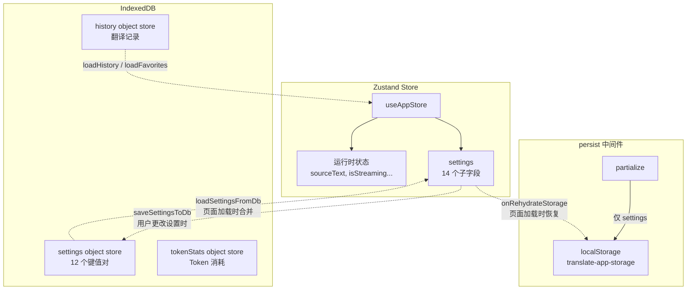
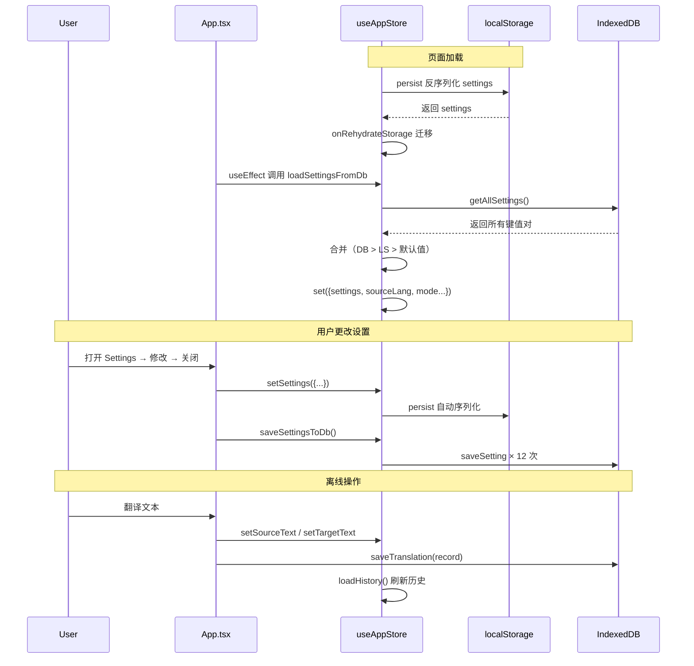

# 状态管理：Zustand 与持久化策略

Moe Translate 的状态管理以 **Zustand** 为核心，辅以双层持久化策略：**localStorage**（快速恢复关键设置）与 **IndexedDB**（完整数据离线持久化）。本文深入拆解 `useAppStore.ts` 的设计，聚焦 `persist` 中间件的 `partialize` 配置、`onRehydrateStorage` 数据迁移、状态字段图谱，以及两种持久化机制的协作方式。

---

## 1. 架构总览：create<AppState>()(persist(...))

整个 Store 的定义嵌套三层：

```
create<AppState>()(    ← Zustand 核心
  persist(             ← 中间件：自动序列化到 localStorage
    (set, get) => ({ ... }),   ← Store 实现
    { name, partialize, onRehydrateStorage }  ← persist 配置
  )
)
```

这种结构将 **状态定义** 与 **持久化策略** 解耦。`persist` 中间件拦截 `set` 调用，在每次状态变更后将 `partialize` 返回的子集写入 `localStorage`。应用启动时，中间件自动从 `localStorage` 读取数据并回填到 Zustand 状态树。[来源](hooks/useAppStore.ts#L122-L295)

---

## 2. partialize：仅持久化 settings 子集

`partialize` 是 `persist` 的筛选函数，决定哪些状态字段被写入 `localStorage`：

```typescript
partialize: (state) => ({
  settings: state.settings
})
```

这意味着 localStorage 中仅存储 `settings` 对象（约 14 个字段），而以下 **运行时状态** 永远不会被持久化：

| 类别 | 字段 | 原因 |
|------|------|------|
| 输入/输出 | sourceText, targetText | 每次会话独立，无需恢复 |
| 流式状态 | isStreaming, thinkingContent | 瞬时状态，不可序列化 |
| 历史数据 | history, favorites | 体积大，由 IndexedDB 管理 |
| UI 开关 | showHistory, showSettings | 会话级偏好 |
| 文档翻译 | docSourceText, docTargetText 等 | 会话级 |

**设计意图**：localStorage 的容量限制（通常 5-10 MB）不适合存储翻译历史或大文本。`settings` 是唯一需要在页面刷新后立即恢复的关键数据——否则用户每次都要重新选择语言、提供商和模型。[来源](hooks/useAppStore.ts#L281-L283)

---

## 3. onRehydrateStorage：旧版本数据迁移

`onRehydrateStorage` 在 `persist` 从 localStorage 恢复数据后 **同步执行**，负责处理 Schema 变更兼容。当前版本的迁移逻辑：

```typescript
onRehydrateStorage: () => (state) => {
  if (state && state.settings) {
    // 修复 1: customProviders 必须为数组
    if (!Array.isArray(settings.customProviders)) {
      settings.customProviders = [];
    }
    // 修复 2: 老版本 apiKey 迁移到 providerApiKeys
    if (!settings.providerApiKeys || typeof settings.providerApiKeys !== 'object') {
      const oldApiKey = (settings as any).apiKey;
      settings.providerApiKeys = oldApiKey ? { deepseek: oldApiKey } : {};
    }
    // 修复 3: 兜底默认值
    if (!settings.selectedProvider) settings.selectedProvider = 'deepseek';
    if (!settings.selectedModel) settings.selectedModel = 'deepseek-v4-flash';
  }
}
```

需要特别关注的是 **老 apiKey → providerApiKeys** 迁移：早期版本使用扁平字段 `apiKey`（仅支持 DeepSeek），多提供商重构后改为 `providerApiKeys: Record<string, string>`。此迁移确保升级后老用户的 API Key 不会丢失。`onRehydrateStorage` 返回的函数是纯同步操作，在 React 渲染之前执行完毕。[来源](hooks/useAppStore.ts#L284-L295)

---

## 4. 完整状态字段与 Setter 清单

### 4.1 核心翻译状态（6 字段）

| 字段 | 类型 | 默认值 | Setter |
|------|------|--------|--------|
| `sourceText` | `string` | `''` | `setSourceText(text)` |
| `targetText` | `string` | `''` | `setTargetText(text)` |
| `sourceLang` | `string` | `'auto'` | `setSourceLang(lang)` |
| `targetLang` | `string` | `'zh'` | `setTargetLang(lang)` |
| `mode` | `'translation' \| 'parsing'` | `'translation'` | `setMode(mode)` |
| `style` | `string` | `'unspecified'` | `setStyle(style)` |

[来源](hooks/useAppStore.ts#L51-L63)

### 4.2 流式与 UI 状态

| 字段 | 类型 | 默认值 | Setter |
|------|------|--------|--------|
| `isStreaming` | `boolean` | `false` | `setIsStreaming(streaming)` |
| `thinkingContent` | `string` | `''` | `setThinkingContent(content)` |
| `showHistory` | `boolean` | `false` | `setShowHistory(show)` |
| `showSettings` | `boolean` | `false` | `setShowSettings(show)` |
| `customStyle` | `string` | `''` | `setCustomStyle(style)` |
| `activeTab` | `'translate' \| 'explain' \| 'doc'` | `'translate'` | `setActiveTab(tab)` |
| `translationError` | `string` | `''` | `setTranslationError(error)` |

[来源](hooks/useAppStore.ts#L57-L71)

### 4.3 历史与收藏

| 字段 | 类型 | 默认值 | Setter / Action |
|------|------|--------|-----------------|
| `history` | `TranslationRecord[]` | `[]` | `loadHistory()` ⚡ |
| `favorites` | `TranslationRecord[]` | `[]` | `loadFavorites()` ⚡ |
| — | — | — | `addToHistory(record)` ⚡ |
| — | — | — | `toggleFavorite(id)` ⚡ |
| — | — | — | `deleteRecord(id)` ⚡ |
| — | — | — | `clearHistory()` ⚡ |
| — | — | — | `exportData()` ⚡ |
| — | — | — | `importData(json)` ⚡ |

标有 ⚡ 的为异步 Action，直接调用 `db.ts` 中的 IndexedDB 操作。[来源](hooks/useAppStore.ts#L58-L69)

### 4.4 文档翻译状态

| 字段 | 类型 | 默认值 | Setter |
|------|------|--------|--------|
| `docSourceText` | `string` | `''` | `setDocSourceText(text)` |
| `docTargetText` | `string` | `''` | `setDocTargetText(text)` |
| `docSourceLang` | `string` | `'auto'` | `setDocSourceLang(lang)` |
| `docTargetLang` | `string` | `'zh'` | `setDocTargetLang(lang)` |
| `docIsStreaming` | `boolean` | `false` | `setDocIsStreaming(streaming)` |
| `docProgress` | `string` | `''` | `setDocProgress(progress)` |
| — | — | — | `appendDocTargetText(text)` ✚ |

`appendDocTargetText` 是唯一的 **追加式** Setter，使用 `set((state) => ({ docTargetText: state.docTargetText + text }))` 实现流式拼接。[来源](hooks/useAppStore.ts#L83-L90)

### 4.5 替代翻译（Alternatives）

| 字段 | 类型 | 默认值 | Setter |
|------|------|--------|--------|
| `alternatives` | `string[]` | `[]` | `setAlternatives(alternatives)` |
| `showAlternatives` | `boolean` | `false` | `setShowAlternatives(show)` |
| `isLoadingAlternatives` | `boolean` | `false` | `setIsLoadingAlternatives(loading)` |
| `originalTranslation` | `string` | `''` | `setOriginalTranslation(text)` |

[来源](hooks/useAppStore.ts#L92-L97)

### 4.6 settings 子对象（AppSettings 接口）

`settings` 是唯一被持久化的字段，包含 14 个子属性：

| 属性 | 类型 | 默认值 |
|------|------|--------|
| `defaultSourceLang` | `string` | `'auto'` |
| `defaultTargetLang` | `string` | `'zh'` |
| `defaultMode` | `'translation' \| 'parsing'` | `'translation'` |
| `defaultStyle` | `string` | `'unspecified'` |
| `customStyle` | `string` | `''` |
| `customInstructions` | `string` | `''` |
| `glossary` | `string` | `''` |
| `selectedProvider` | `string` | `'deepseek'` |
| `selectedModel` | `string` | `'deepseek-v4-flash'` |
| `providerApiKeys` | `Record<string, string>` | `{}` |
| `customLanguages` | `CustomLanguage[]` | `[]` |
| `customProviders` | `CustomProvider[]` | `[]` |
| `jinaApiKey` | `string` | `''` |
| `thinkingEnabled` | `boolean` | `false` |

Setter 为 `setSettings(newSettings: Partial<AppSettings>)`，使用 **浅合并** 策略：
```typescript
setSettings: (newSettings) => set((state) => ({
  settings: { ...state.settings, ...newSettings }
}))
```
这意味着你可以只传入 `{ selectedProvider: 'openai' }` 而不影响其他设置。[来源](hooks/useAppStore.ts#L33-L49)

---

## 5. 双重持久化：localStorage vs IndexedDB

Moe Translate 采用 **分层持久化** 策略，两种存储各司其职：



### 5.1 对比总结

| 维度 | localStorage（Zustand persist） | IndexedDB（db.ts） |
|------|-------------------------------|-------------------|
| **存储内容** | `settings` 子集（14 字段） | settings object store（12 KV）+ 全部历史 + Token 统计 |
| **触发时机** | 每次 `set({ settings })` → 自动同步 | 显式调用 `saveSettingsToDb()`（Settings 组件关闭时） |
| **读取时机** | 页面加载 → persist 自动反序列化 | 页面加载 → `useEffect` 中调用 `loadSettingsFromDb()` |
| **容量** | ~5-10 MB（有限） | 无实际限制 |
| **数据类型** | JSON 序列化 | 结构化数据 + 索引查询 |
| **主要用途** | 快速恢复关键设置，减少白屏 | 完整离线持久化，历史检索 |

[来源](hooks/useAppStore.ts#L247-L260)

### 5.2 为何需要两层？

Zustand 的 `persist` 中间件在 Store **初始化阶段** 同步完成反序列化——这意味着在第一个 React 组件挂载前，`settings` 已经从 localStorage 恢复完毕。而 IndexedDB 的读取是异步的，无法阻塞渲染。

两者存在 **短暂的不一致窗口**：localStorage 提供初始值，IndexedDB 在 `useEffect` 中异步合并覆盖。但此窗口极短（毫秒级），且合并逻辑保证最终一致性。[来源](App.tsx#L136-L139)

---

## 6. loadSettingsFromDb：IndexedDB → Zustand 合并

### 6.1 调用位置

`loadSettingsFromDb` 在 `App.tsx` 的 `useEffect` 中被调用：

```typescript
// App.tsx 关键片段
useEffect(() => {
  loadPromptsFromDB();
  loadSettingsFromDb();
  loadHistory();
  loadFavorites();
}, [loadSettingsFromDb, loadHistory, loadFavorites]);
```

同时，第一个 `useEffect` 做了一个 **条件兜底**——当 `customProviders` 或 `providerApiKeys` 在 localStorage 中为空时，立即从 IndexedDB 恢复：

```typescript
useEffect(() => {
  if (!Array.isArray(safeSettings.customProviders) || 
      Object.keys(safeSettings.providerApiKeys || {}).length === 0) {
    loadSettingsFromDb();
  }
}, []);
```

这解决了 **首次使用用户** 或 **localStorage 被清除** 的场景。[来源](App.tsx#L63-L70)

### 6.2 合并逻辑拆解

`loadSettingsFromDb` 的实现包含三层合并策略：

```typescript
loadSettingsFromDb: async () => {
  const dbSettings = await getAllSettings();        // 从 IndexedDB 读取全部设置
  const currentSettings = get().settings;            // 当前 Zustand 状态（来自 localStorage）

  const migratedSettings = {
    ...currentSettings,                              // 以 localStorage 为基线
    ...dbSettings,                                   // IndexedDB 覆盖
    customProviders: Array.isArray(dbSettings.customProviders) 
      ? dbSettings.customProviders : [],             // 类型安全防御
    providerApiKeys: dbSettings.providerApiKeys 
      || ((dbSettings as any).apiKey 
        ? { deepseek: (dbSettings as any).apiKey } 
        : {}),                                       // 二次迁移兼容
    selectedProvider: dbSettings.selectedProvider || 'deepseek',
    selectedModel: dbSettings.selectedModel || 'deepseek-v4-flash'
  };

  set({
    settings: migratedSettings,
    sourceLang: (dbSettings.defaultSourceLang as string) || currentSettings.defaultSourceLang,
    targetLang: (dbSettings.defaultTargetLang as string) || currentSettings.defaultTargetLang,
    mode: (dbSettings.defaultMode as ...) || currentSettings.defaultMode,
    style: (dbSettings.defaultStyle as string) || currentSettings.defaultStyle,
    customStyle: (dbSettings.customStyle as string) || currentSettings.customStyle,
    sourceText: '',                                  // 清空输入输出
    targetText: '',
    thinkingContent: ''
  });
}
```

**合并优先级**：IndexedDB > localStorage > 硬编码默认值。这意味着：

1. 如果用户从未打开过 Settings 面板（IndexedDB 中无数据），localStorage 值生效
2. 如果 localStorage 被清除但 IndexedDB 数据仍在，后者自动恢复
3. `defaultSourceLang` 等顶层状态也从 `dbSettings` 同步，确保语言选择一致性

**重要细节**：`providerApiKeys` 的双重迁移保护——`onRehydrateStorage` 处理了 localStorage 中的老格式，而 `loadSettingsFromDb` 再次处理了 IndexedDB 中的老格式。[来源](hooks/useAppStore.ts#L263-L278)

### 6.3 getAllSettings 的实现

`db.ts` 中的 `getAllSettings` 读取 IndexedDB `settings` object store 的全部记录，组装成一个扁平对象：

```typescript
export async function getAllSettings(): Promise<Partial<AppSettings>> {
  const db = await getDB();
  return new Promise((resolve, reject) => {
    const transaction = db.transaction(['settings'], 'readonly');
    const store = transaction.objectStore('settings');
    const request = store.getAll();
    
    request.onsuccess = () => {
      const results = request.result as Array<{ key: string; value: unknown }>;
      const settings: Partial<AppSettings> = {};
      for (const item of results) {
        (settings as Record<string, unknown>)[item.key] = item.value;
      }
      resolve(settings);
    };
  });
}
```

对应的 `saveSetting` 和 `getSetting` 是单键操作，用于增量更新。`saveSettingsToDb` 则批量调用 12 次 `saveSetting`，将 Settings 面板关闭时的全部设置写入 IndexedDB。[来源](lib/db.ts#L256-L260)

---

## 7. 数据流全景



---

## 8. 下一步

- 深入了解 IndexedDB 的 Schema 设计与 CRUD 封装：[](indexeddb-数据层设计.md)
- 查看 Settings 组件如何联动 `setSettings` 与 `saveSettingsToDb`：[](api-密钥与提供商配置.md)
- 理解 HistoryPanel 如何通过 `loadHistory` / `loadFavorites` 消费数据：[](历史面板与数据管理.md)