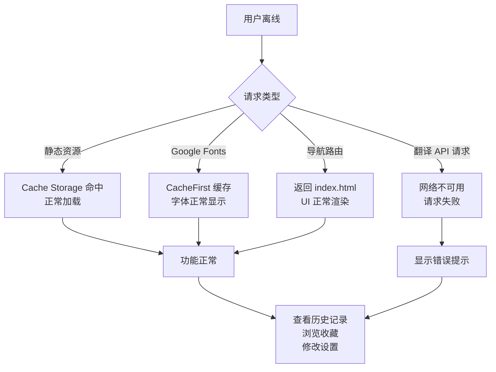

以下是 Wiki 页面「离线策略与性能优化」的完整内容：

---

Moe Translate 作为一款离线优先的 PWA 应用，其离线能力并非"全有或全无"的二元状态，而是一个分层策略：**静态资源完全离线可用，翻译功能依赖网络，历史数据离线可查**。本文从 Workbox 缓存配置入手，逐层分析离线策略的边界，并深入 Token 消耗追踪系统的设计与已知估算问题。

---

## Workbox 缓存策略：三层离线保障

应用的 Service Worker 由 `vite-plugin-pwa` 配合 Workbox 生成，配置集中在 `vite.config.ts` 的 `VitePWA` 插件中 [来源](vite.config.ts#L8-L59)。

### 第一层：预缓存（Precache）

```typescript
workbox: {
  globPatterns: ['**/*.{js,css,html,ico,png,svg,woff2}'],
}
```

`globPatterns` 在构建阶段扫描 `dist` 目录，将所有匹配的静态资源（JS、CSS、HTML、图标、SVG、字体文件）加入预缓存清单。Service Worker 安装时一次性下载这些资源，此后无论网络状态如何，浏览器都能从 Cache Storage 直接加载。这意味着**应用的壳（Shell）——HTML 骨架、样式、脚本、图标——在首次访问后完全离线可用** [来源](vite.config.ts#L41)。

### 第二层：运行时缓存（Runtime Caching）

Google Fonts 的 CSS 和字体文件通过运行时缓存策略按需缓存：

```typescript
runtimeCaching: [
  {
    urlPattern: /^https:\/\/fonts\.googleapis\.com\/.*/i,
    handler: 'CacheFirst',
    options: {
      cacheName: 'google-fonts-cache',
      expiration: {
        maxEntries: 10,
        maxAgeSeconds: 60 * 60 * 24 * 365  // 365天
      },
      cacheableResponse: { statuses: [0, 200] }
    }
  },
  {
    urlPattern: /^https:\/\/fonts\.gstatic\.com\/.*/i,
    handler: 'CacheFirst',
    options: {
      cacheName: 'gstatic-fonts-cache',
      expiration: { maxEntries: 10, maxAgeSeconds: 31536000 },  // 365天
      cacheableResponse: { statuses: [0, 200] }
    }
  }
]
```

关键设计决策：

- **策略选择 `CacheFirst`**：字体文件不常变更，首次请求后缓存命中即返回，无需网络确认。两个缓存名称（`google-fonts-cache`、`gstatic-fonts-cache`）分别隔离 CSS 和字体文件。
- **过期时间 365 天**：字体文件版本稳定，长缓存周期减少网络请求。
- **`maxEntries: 10`**：限制同一缓存中的条目数量，防止用户切换字体变体时无限膨胀 [来源](vite.config.ts#L44-L58)。

构建后，生成的 `sw.js` 中可直接验证这些路由注册逻辑 [来源](dist/sw.js#L1)（搜索 `CacheFirst` 和 `google-fonts-cache` 确认）。

### 第三层：Navigation Route（导航回退）

```
e.registerRoute(new e.NavigationRoute(e.createHandlerBoundToURL("index.html")))
```

任何未匹配预缓存的路由请求（如直接访问 `/some-path`），Service Worker 均返回 `index.html`。这是 SPA 的标配策略，确保用户在离线时刷新页面不会看到浏览器默认的离线页面 [来源](dist/sw.js#L1)。

### 自动更新策略

```typescript
registerType: 'autoUpdate',
```

`autoUpdate` 意味着 Service Worker 检测到新版本后，跳过 `waiting` 阶段，立即接管页面。用户无需手动刷新即可获得最新代码。代价是：如果新 SW 中缓存策略有破坏性变更，用户可能无感知地遇到缓存问题 [来源](vite.config.ts#L9)。

---

## 离线体验的现实边界

理解上述缓存策略后，可以清晰画出离线体验的**能力边界图**：



翻译请求依赖 LLM API 的 HTTP 端点，需要网络连接。离线时：

- 用户可以浏览历史翻译记录（从 IndexedDB 读取，见 [IndexedDB 数据层设计](indexeddb-数据层设计.md)）
- 可以管理收藏、导出/导入数据（见 [历史面板与数据管理](历史面板与数据管理.md)）
- 可以修改应用设置（见 [状态管理：Zustand 与持久化策略](状态管理-zustand-与持久化策略.md)）
- **无法发起新的翻译或解释请求**

这就是"离线优先"而非"完全离线"的含义：保证用户界面的可用性和历史数据的可访问性，但核心翻译功能仍受网络约束。

---

## Token 消耗追踪系统

为了帮助用户了解 API 使用成本，系统在 IndexedDB 中维护了 `tokenStats` 对象存储，提供按月统计的 Token 消耗追踪 [来源](src/lib/db.ts#L410-L455)。

### 数据模型

```typescript
export interface TokenStats {
  totalTokens: number;     // 累计（不含当月）
  monthlyTokens: number;   // 当月消耗
  lastResetDate: string;   // 格式: "2024-01"
}
```

### 四个核心函数

**`getTokenStats()`**：读取当前统计。首次调用或跨月时自动执行重置逻辑——如果 `lastResetDate !== 当前月份`，则将 `monthlyTokens` 归零，`totalTokens` 累加上一月的消耗。这确保了"累计"和"月度"两条数据线相互独立 [来源](src/lib/db.ts#L376-L408)。

**`addTokenUsage(tokens)`**：将新消耗的 token 数同时累加到 `totalTokens` 和 `monthlyTokens` 上，然后写回 IndexedDB。每次翻译完成后调用（见下） [来源](src/lib/db.ts#L410-L428)。

**`getLastUsage()`** / **`setLastUsage(tokens)`**：分别读取和写入最近一次翻译的 token 消耗数。用于在翻译完成后在界面上显示"本次消耗 X tokens"的角标 [来源](src/lib/db.ts#L431-L455)。

### 调用链路

每次翻译完成后，`useTranslation.ts` 中的流程如下：

```
LLM 流式响应 → onDone 回调收到 TokenUsage → addTokenUsage(total_tokens) → setLastUsage(total_tokens)
```

关键代码片段：

```typescript
if (lastUsage) {
  await addTokenUsage(lastUsage.total_tokens);
  await setLastUsage(lastUsage.total_tokens);
}
```

[来源](src/hooks/useTranslation.ts#L140-L141)

### Token 数据的来源

Token 计数并非本地预估，而是来自 LLM API 返回的 `usage` 字段。`llmClient.ts` 在解析 SSE 流时捕获 `data.usage` 并传递给 `onDone` 回调 [来源](src/lib/llmClient.ts#L137-L139)。

```typescript
export interface TokenUsage {
  prompt_tokens: number;
  completion_tokens: number;
  total_tokens: number;
}
```

[来源](src/lib/llmClient.ts#L6-L11)

### 用户界面的呈现

Token 统计通过两个入口暴露给用户：

1. **本次消耗角标**：翻译完成后，在翻译结果下方显示 `"X,XXX tokens ~$0.00XXXX"`（含费用估算）[来源](dist/assets/index-Czod6a6h.js#L682)（搜索 `token-usage-badge`）
2. **统计弹窗**：点击头部栏的柱状图图标，弹出 `stats-modal`，展示 `totalTokens` 和 `monthlyTokens` [来源](dist/assets/index-Czod6a6h.js#L695)（搜索 `stats-modal`）

费用估算利用了模型配置中的 `pricing_input` 和 `pricing_output`（单位：每百万 token 价格），按 50% 输入 / 50% 输出比例计算 [来源](src/lib/prompts/loadPrompts.ts#L371-L372)。

---

## 已知的 Token 估算问题

### 文档翻译中的粗略估算

在文档翻译场景中，上传文件后需要估算 token 数量以判断是否超出模型上下文窗口。当前的实现使用了极简公式：

```typescript
const estimatedTokens = Math.ceil(docSourceText.length / 3.5);
```

[来源](src/components/DocumentTranslation/DocumentTranslation.tsx#L272)

这个公式假设**每 3.5 个字符约等于 1 个 token**，这是对英文的自然语言平均估算值。但对于中文（每个字约 1-2 tokens）、代码（token 密度更高）或混合文本，误差可能很大。该估算值仅用于显示"约 X tokens"的提示，以及判断文档是否超过模型最大上下文限制 [来源](src/components/DocumentTranslation/DocumentTranslation.tsx#L274)。

### 计划中的改进：tiktoken 集成

README 的 TODO 部分明确记录了改进方向：

> - [ ] Implement proper tokenizer for accurate token counting
>   - Current estimation uses: `characters / 3.5 ≈ tokens`
>   - Consider different tokenizers for different models
>   - Use tiktoken or similar for accurate counting

[来源](README.md#L206)

计划要点包括：

1. **引入 tiktoken 或同类库**：tiktoken 是 OpenAI 开源的 BPE tokenizer，可以精确计算特定模型的 token 数（如 `cl100k_base` 用于 GPT-4，`o200k_base` 用于 GPT-4o）。
2. **模型级 tokenizer 配置**：不同模型使用不同的 tokenizer，需要在模型定义中关联 tokenizer 类型。自定义模型也应支持指定 tokenizer。
3. **应用场景**：文档上传时更准确的 token 预估，以及潜在的"在达到上下文窗口前主动截断"保护机制 [来源](src/components/DocumentTranslation/DocumentTranslation.tsx#L21-L27)。

---

## 与周边模块的关系

| 关系模块 | 关联点 |
|----------|--------|
| [IndexedDB 数据层设计](indexeddb-数据层设计.md) | `tokenStats` 与 `history`、`settings` 共享同一个 IndexedDB 数据库实例 |
| [状态管理：Zustand 与持久化策略](状态管理-zustand-与持久化策略.md) | Token 统计不通过 Zustand 持久化（避免冗余），直接从 IndexedDB 读取 |
| [LLM 流式 API 客户端架构](llm-流式-api-客户端架构.md) | `llmClient.ts` 的 `onDone` 回调输出 `TokenUsage`，是 Token 数据的原始来源 |
| [构建工具链与配置](构建工具链与配置.md) | Workbox 配置集成在 Vite 构建管线中，构建产物直接影响离线能力 |
| [PWA 安装与离线使用](pwa-安装与离线使用.md) | PWA 安装流程与 Service Worker 注册是离线策略的交付载体 |

---

## 下一步

- 了解 IndexedDB 中 `tokenStats` 与其他数据存储的完整 schema，请阅读 [IndexedDB 数据层设计](indexeddb-数据层设计.md)
- 深入了解 LLM 流式响应中 `usage` 字段的解析，请阅读 [LLM 流式 API 客户端架构](llm-流式-api-客户端架构.md)
- 如果计划部署到生产环境，[Cloudflare Pages 部署指南](cloudflare-pages-部署指南.md) 中包含了 `_headers` 和 `_routes.json` 的配置说明，确保 Service Worker 正确注册