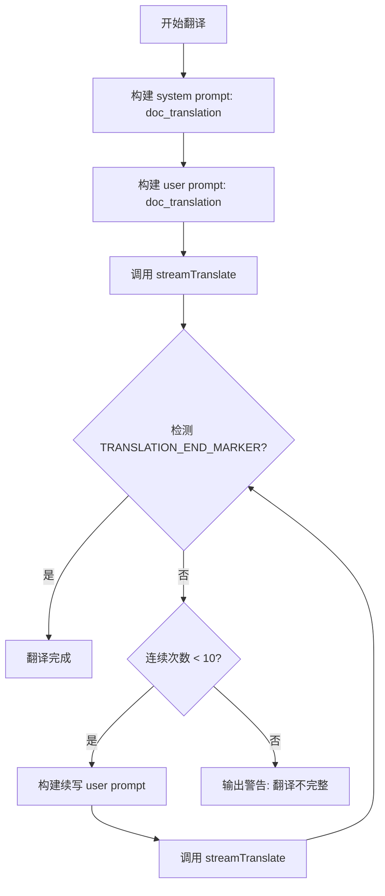

现在我已经掌握了所有关键源码，开始撰写页面。

---

# 翻译模式与解释模式详解

Moe Translate 的核心工作模式由三个互斥选项构成——**翻译模式**、**解释模式**和**文档翻译模式**。这三种模式共享相同的 LLM 流式调用管线，但通过不同的 **system prompt**（系统提示词）和 **user prompt**（用户提示词）模板来驱动模型产生截然不同的输出行为。理解它们的差异是深入使用和定制本应用的前提。

## 从 Tab 到 mode 的联动

三种模式的切换入口是顶部的三栏 Tab 导航——`translate`、`explain`、`doc`。当用户点击 Tab 时，`handleTabChange` 函数同时更新两个状态：`activeTab` 和 `mode`。

```typescript
const handleTabChange = (tab: 'translate' | 'explain' | 'doc') => {
  setActiveTab(tab);
  if (tab === 'explain') {
    setMode('parsing');
  } else {
    setMode('translation');
  }
};
```

[来源](src/App.tsx#L140-L146)

这里有一个重要的设计细节：`mode` 只有两个可能值——`'translation'` 和 `'parsing'`。文档翻译模式（`tab === 'doc'`）在 mode 层面仍被归类为 `'translation'`，它的特殊性体现在**另一套独立的提示词函数**（`buildDocSystemPrompt`、`buildDocUserPrompt`）上。`activeTab` 控制 UI 渲染哪个视图，而 `mode` 控制 `useTranslation.ts` 中 `translate` 函数选择哪套提示词模板。

[来源](src/hooks/useAppStore.ts#L51-L55)

---

## 三种模式的核心差异

下表从提示词选择、输出约束和终端标记三个维度对比三种模式：

| 维度 | 翻译模式 | 解释模式 | 文档翻译模式 |
|---|---|---|---|
| **Tab** | `translate` | `explain` | `doc` |
| **mode 值** | `translation` | `parsing` | `translation`（复用） |
| **system prompt** | `system.translation` | `system.parsing` | `system.doc_translation` / `system.translation_long` |
| **user prompt** | `user.translation` | `user.parsing` | `user.doc_translation` / `user.translation_long` |
| **输出约束** | 仅输出翻译，不附加任何说明 | 以目标语言返回单词/短语的详细解析 | 输出完整翻译后附加 `<!-- TRANSLATION_END -->` |
| **连续续写** | 无 | 无 | 支持（最多 10 次续写） |

---

## 翻译模式：纯粹的译文输出

当 `mode === 'translation'` 时，`buildSystemPrompt` 从 prompts.yaml 中读取 `system.translation` 模板：

```
You are a professional translator. You will receive text in {{source_lang}} 
and translate it to {{target_lang}}.
The user has requested the following style/tone: {{style}}
Only provide the translation, nothing else. 
Do not include any explanations, notes, or additional text.
```

[来源](src/lib/prompts/prompts.yaml#L5-L9)

关键指令是 *"Only provide the translation, nothing else"*——这强制 LLM 只输出译文，不附带任何解释性文字。配合的 user prompt 更为简洁：

```
Translate this {{source_lang}} text to {{target_lang}}:
{{text}}
```

[来源](src/lib/prompts/prompts.yaml#L81-L83)

在 `buildSystemPrompt` 的实现中，模板变量通过 `.replace()` 逐一替换：`{{source_lang}}` 替换为语言名称（如 "English"），`{{target_lang}}` 替换为目标语言名称（如 "Chinese"），`{{style}}` 替换为 `prompts.styles` 中对应风格的描述文本。如果传入了 `customInstructions` 或 `glossary`，它们会被追加到 system prompt 末尾。

[来源](src/lib/prompts/loadPrompts.ts#L137-L177)

```typescript
export function buildSystemPrompt(
  mode: 'translation' | 'parsing',
  sourceLang: string,
  targetLang: string,
  style: string,
  customStyle?: string,
  customInstructions?: string,
  glossary?: string
): string {
  const prompts = loadPrompts();
  let systemPrompt = mode === 'translation' 
    ? prompts.system.translation 
    : prompts.system.parsing;
  // ...模板变量替换...
}
```

翻译模式的输出**不包含任何结束标记**——当流式传输结束时，`removeEndMarker` 只是安全地清理可能存在的 `<!-- TRANSLATION_END -->`（实际上从未存在），返回的文本就是纯粹的译文。

[来源](src/hooks/useTranslation.ts#L110-L113)

---

## 解释模式：语言分析的格式化输出

当用户切换到"解释"Tab（`activeTab === 'explain'`），`mode` 被设为 `'parsing'`。此时 `buildSystemPrompt` 读取的是 `system.parsing` 模板：

### System Prompt 模板

```
You are a language analysis assistant. Explain the meaning and usage of 
the following {{source_lang}} word or phrase.
IMPORTANT: You MUST respond IN {{target_lang}}.

If it's a SINGLE WORD:
- Give definition, pronunciation (IPA), word type (n./v./adj/etc)
- Give 2-3 example sentences or collocations
- Mention word roots/prefixes/suffixes IF it has notable ones

If it's a PHRASE OR SENTENCE:
- Explain the meaning and grammar structure
- Note any special expressions or idioms
- Give pronunciation if relevant

IMPORTANT: Only include sections that are RELEVANT. Skip any section 
that doesn't apply.
Format your response with clear structure. Only provide the analysis, 
nothing else.
```

[来源](src/lib/prompts/prompts.yaml#L17-L32)

### User Prompt 模板

```
Explain this {{source_lang}} word/phrase in {{target_lang}}. 
Only include relevant information:
{{text}}
```

[来源](src/lib/prompts/prompts.yaml#L89-L91)

注意：解释模式的 system prompt 中没有 `{{style}}` 占位符，因为风格参数在这个模式下不适用。`buildSystemPrompt` 在 `mode === 'parsing'` 时不会执行风格相关的模板替换（prompts.yaml 的 parsing 模板中根本没有 `{{style}}`），所以模板变量替换会静默跳过不存在的占位符。

[来源](src/lib/prompts/loadPrompts.ts#L146-L163)

单元测试验证了解释模式下会正确注入语言名称并跳过风格变量：

```typescript
it('should build parsing system prompt', () => {
  const prompt = buildSystemPrompt('parsing', 'ja', 'en', 'casual');
  expect(prompt).toContain('Japanese');
  expect(prompt).toContain('English');
  expect(prompt).not.toContain('{{style}}');
});
```

[来源](src/tests/unit/promptBuilder.test.ts#L24-L30)

### 输出渲染差异

解释模式的输出在 UI 中默认通过 `MarkdownRenderer` 组件渲染（因为 LLM 生成的解释通常使用 Markdown 结构化格式），而翻译模式的输出默认显示为纯文本。这个开关由 `renderMarkdown` 状态控制，用户也可以手动切换：

```typescript
const [renderMarkdown, setRenderMarkdown] = useState(activeTab === 'explain');
```

[来源](src/App.tsx#L94)

---

## 文档翻译模式：带结束标记的完整翻译

文档翻译是三种模式中最复杂的一种。它在 **`DocumentTranslation`** 组件中独立实现，使用自己的一套提示词构建函数和续写循环。

### 提示词策略

文档翻译使用两套不同的 system/user prompt 组合：

**首次翻译**使用 `system.doc_translation` 和 `user.doc_translation`：

```
# system.doc_translation
You are a professional translator. You will receive content in {{source_lang}} 
and translate it to {{target_lang}}.
...
IMPORTANT RULES:
1. Translate ALL paragraphs completely. Do NOT stop mid-paragraph.
2. When you finish translating the ENTIRE document, you MUST end your response 
   with the marker: <!-- TRANSLATION_END -->
3. Do NOT say "Here is the translation" or any introduction. 
   Start translating immediately.
4. Keep the SAME markdown structure as the original...
5. Preserve all markdown formatting symbols...
```

[来源](src/lib/prompts/prompts.yaml#L34-L48)

```
# user.doc_translation
Translate the following {{source_lang}} markdown content to {{target_lang}}.
Remember to end with <!-- TRANSLATION_END --> when the ENTIRE document 
is translated.

Content to translate:
{{text}}
```

[来源](src/lib/prompts/prompts.yaml#L97-L101)

**长文本续写**使用 `system.translation_long` 和 `user.translation_continue`：

```
# user.translation_continue
The previous translation was cut off. Please continue translating from 
where it stopped.
Start your response immediately with the continuation...
Last 50 characters of previous translation: "{{last_content}}"

Continue translating:
{{remaining_text}}
```

[来源](src/lib/prompts/prompts.yaml#L85-L88)

### 结束标记检测与续写循环

文档翻译模式的核心机制是 **`TRANSLATION_END_MARKER`**（即 `<!-- TRANSLATION_END -->`）。`checkTranslationComplete` 函数检查响应中是否包含该标记：

```typescript
export const TRANSLATION_END_MARKER = '<!-- TRANSLATION_END -->';

export function checkTranslationComplete(content: string): boolean {
  return content.includes(TRANSLATION_END_MARKER);
}

export function removeEndMarker(content: string): string {
  return content.replace(TRANSLATION_END_MARKER, '').trim();
}
```

[来源](src/lib/prompts/loadPrompts.ts#L274-L282)

### 完整的续写流程



在 `DocumentTranslation.handleTranslate` 中的实现：

```typescript
const tryTranslate = async (text: string, isContinuation: boolean = false) => {
  let userPrompt: string;
  if (isContinuation) {
    userPrompt = buildUserPromptContinue(
      fullResponse.slice(-50),  // 取最后 50 字符供 LLM 参考上下文
      text
    );
  } else {
    userPrompt = buildDocUserPrompt(sourceLang, docTargetLang, text);
  }
  // ...调用 streamTranslate ...
};

await tryTranslate(textToTranslate);

while (!isComplete && continuationCount < maxContinuations) {
  continuationCount++;
  await tryTranslate('', true);  // 续写时传入空文本
}
```

[来源](src/components/DocumentTranslation/DocumentTranslation.tsx#L133-L166)

关键细节：

1. **续写时传入空字符串 `''`**：因为源文本已经在首次调用中完整发送，续写仅需要 LLM 继续生成剩余译文。
2. **最多续写 10 次**：超出后停止并显示警告 `docTranslation.warning`。
3. **每次续写携带上次译文的最后 50 字符**：帮助 LLM 保持上下文连贯。

### 代码块保护

文档翻译还集成了一项 Markdown 感知的预处理：`parseMarkdown` 函数将源文本分割为 `text` 和 `code` 两种块，system prompt 明确要求 *"do NOT translate content inside code blocks"*。但这种分区目前仅用于 UI 预览，实际的翻译调用仍然传入整个 `plainText`。[来源](src/components/DocumentTranslation/DocumentTranslation.tsx#L30-L67)

---

## 三种模式在 useTranslation 中的统一调度

虽然文档翻译有独立的组件和提示词函数，但常规的翻译/解释共用 `useTranslation` 中的 `translate` 函数。该函数在运行时根据 `mode` 状态选择提示词模板：

```typescript
const systemPrompt = buildSystemPrompt(
  mode,              // 'translation' | 'parsing'
  resolvedSourceLang,
  targetLang,
  style,
  customStyle,
  customInstructions || undefined,
  glossary || undefined
);

const userPrompt = buildUserPrompt(
  mode,              // 'translation' | 'parsing'
  resolvedSourceLang,
  targetLang,
  sourceText
);
```

[来源](src/hooks/useTranslation.ts#L89-L103)

流式回调中统一调用 `removeEndMarker` 清理输出（对翻译/解释模式是空操作，对文档翻译模式则移除标记）：

```typescript
callbacks: {
  onChunk: (text) => {
    fullResponse += text;
    setTargetText(removeEndMarker(fullResponse));
  },
  // ...
}
```

[来源](src/hooks/useTranslation.ts#L109-L112)

---

## 三种模式的使用场景对比

| 使用场景 | 推荐模式 | 原因 |
|---|---|---|
| 快速获取一段文字的翻译 | 翻译模式 | 输出纯净，不含额外信息，适合复制粘贴 |
| 学习外语单词或短语 | 解释模式 | 返回释义、音标、词性、例句，提供 Markdown 格式化输出 |
| 翻译完整的 Markdown 文件或长文档 | 文档翻译模式 | 支持续写以突破输出长度限制，保留 Markdown 结构，保护代码块 |
| 翻译长文本但不需保留格式 | 翻译模式 + 手动分段 | 文档翻译模式有较高的 Token 消耗（含续写开销） |

---

## 定制与扩展

所有三种模式的提示词模板都定义在 `prompts.yaml` 中，可以从应用设置界面进行覆盖。关于提示词系统的完整机制，参见 [YAML 驱动的提示词引擎](yaml-驱动的提示词引擎.md)。关于长文本分段续写的更多细节，参见 [长文本与文档翻译的分段策略](长文本与文档翻译的分段策略.md)。

---

## 下一步

- 了解如何通过[翻译风格与自定义指令](翻译风格与自定义指令.md)进一步约束 LLM 输出
- 查看 [YAML 驱动的提示词引擎](yaml-驱动的提示词引擎.md) 了解模板变量替换和数据流向的完整设计
- 阅读 [长文本与文档翻译的分段策略](长文本与文档翻译的分段策略.md) 深入理解续写机制的边界情况