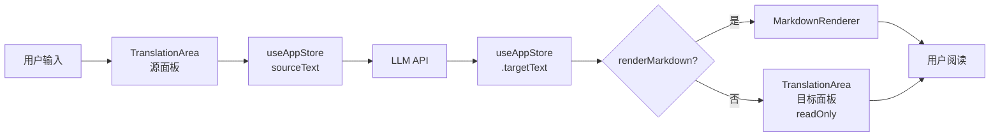

以下是 Wiki 页面内容：

---

# 翻译组件：TranslationArea 与 MarkdownRenderer

翻译面板是 Moe Translate 的核心交互区域。用户在这里输入原文、查看译文，并在解释模式下浏览格式化后的 Markdown 输出。整个面板由两个关键组件构成：**TranslationArea**（文本输入框封装）和 **MarkdownRenderer**（Markdown 渲染器），它们在 `App.tsx` 中被编排为源面板（source-panel）和目标面板（target-panel）的双栏布局。

## TranslationArea：受控 textarea 的封装模式

`TranslationArea` 本质上是对原生 `<textarea>` 的轻量封装，但它通过两种设计模式解决了可复用组件的关键问题：**属性透传**与 **ref 转发**。

### forwardRef：让父组件直接操作 DOM

组件的定义使用了 `React.forwardRef`，将 ref 转发给内部的 `<textarea>` 元素：

```tsx
export const TranslationArea = forwardRef<HTMLTextAreaElement, TranslationAreaProps>(
  ({ label, className = '', ...props }, ref) => {
    return (
      <div className={`translation-area ${className}`}>
        {label && <span className="area-label">{label}</span>}
        <textarea ref={ref} className="area-textarea" {...props} />
      </div>
    );
  }
);
```

这样做的好处是：父组件（如 `App.tsx`）可以通过 ref 直接调用 textarea 的 DOM 方法（例如 `focus()`、`select()` 或读取 `scrollHeight` 实现自动高度），而不必通过 state 间接控制。`TranslationArea.displayName = 'TranslationArea'` 的显式赋值则确保了 React DevTools 中的调试可读性。[来源](../src/components/TranslationArea/TranslationArea.tsx#L1-L16)

### TextareaHTMLAttributes：零成本的属性透传

`TranslationAreaProps` 接口继承了 `TextareaHTMLAttributes<HTMLTextAreaElement>`，这意味着原生 textarea 的所有 HTML 属性——`value`、`onChange`、`placeholder`、`disabled`、`readOnly`、`rows`、`maxLength` 等——都可以直接通过 props 传入，并由 `...props` 展开到 `<textarea>` 上：

```tsx
interface TranslationAreaProps extends TextareaHTMLAttributes<HTMLTextAreaElement> {
  label?: string;
}
```

这种模式的优势在于：组件无需为每个 HTML 属性声明 prop，所有标准属性天然可用。这也是 React 社区中构建基础表单组件的推荐做法。[来源](../src/components/TranslationArea/TranslationArea.tsx#L3-L5)

### CSS 模块化：变量驱动的主题适配

样式文件 `TranslationArea.css` 完全使用 CSS 自定义属性（var），没有硬编码任何颜色或间距值：

| CSS 变量 | 用途 |
|---|---|
| `--color-bg` | textarea 背景色 |
| `--color-text` | 文字颜色 |
| `--color-text-secondary` | label 文字颜色 |
| `--color-text-placeholder` | placeholder 文字颜色 |
| `--color-bg-secondary` | 禁用状态背景色 |
| `--font-size-*` / `--spacing-*` | 字号与间距 |

这种设计使组件能无缝适配[深色模式和用户自定义主题](css-变量主题系统与样式自定义.md)。值得注意的是，`resize: none` 禁用了 textarea 的大小调整手柄，以保持布局稳定。[来源](../src/components/TranslationArea/TranslationArea.css#L1-L31)

## MarkdownRenderer：将 LLM 输出结构化呈现

当 LLM 返回包含 Markdown 标记的内容时（在解释模式下尤为常见），纯文本 textarea 无法展示层级结构。`MarkdownRenderer` 利用 **react-markdown** 配合 GFM（GitHub Flavored Markdown）插件完成渲染：

```tsx
import ReactMarkdown from 'react-markdown';
import remarkGfm from 'remark-gfm';

export function MarkdownRenderer({ content, className = '' }: MarkdownRendererProps) {
  return (
    <div className={`markdown-renderer ${className}`}>
      <ReactMarkdown remarkPlugins={[remarkGfm]}>
        {content}
      </ReactMarkdown>
    </div>
  );
}
```

### react-markdown：安全渲染的首选

与 `dangerouslySetInnerHTML` 不同，react-markdown 将 Markdown 文本解析为虚拟 DOM 树，再渲染为 React 元素。这意味着它天然防范 XSS 注入——任何 HTML 标签都不会被直接执行，而是被解析为文本或忽略。[来源](../src/components/MarkdownRenderer/MarkdownRenderer.tsx#L1-L14)

### remark-gfm：表格、任务列表与删除线

`remark-gfm` 是 GFM 规范的 remark 插件。它扩展了标准 Markdown 语法，支持：

- **表格**：带表头、对齐和边框的 `<table>` 渲染
- **任务列表**：`- [x]` 语法生成复选框
- **删除线**：`~~文本~~` 渲染为带删除线的文本
- **URL 自动链接**：裸 URL 自动转为可点击链接

这些特性在解释模式下格外重要，因为 LLM 经常以表格形式对比概念、用列表分步说明、用代码块展示示例。[来源](../src/components/MarkdownRenderer/MarkdownRenderer.css#L1-L99)

### CSS 样式层级

`MarkdownRenderer.css` 为每种 Markdown 元素定义了完整的排版样式：

- **标题** `h1`–`h3`：使用 `--font-size-2xl` 到 `--font-size-lg` 三级字号，`h1` 带底部边框
- **代码** `code` / `pre`：等宽字体、圆角背景、`pre` 带横向滚动
- **引用** `blockquote`：左侧 4px 主题色边框
- **表格** `th` / `td`：带 `--color-border` 边框，表头有背景色区分

全部使用 CSS 变量，与主题系统保持一致。[来源](../src/components/MarkdownRenderer/MarkdownRenderer.css#L1-L99)

## App.tsx 中的编排：两个实例，三种状态

在 `App.tsx` 中，`TranslationArea` 被实例化两次，分别服务于源面板（输入原文）和目标面板（展示译文）。它们的配置截然不同，反映了**输入**与**输出**的本质差异。

### 源面板：可编辑的受控输入

```tsx
<TranslationArea
  value={useAppStore.getState().sourceText}
  onChange={(e) => useAppStore.getState().setSourceText(e.target.value)}
  placeholder={activeTab === 'explain' ? t('explain.placeholder') : t('translation.placeholder')}
  disabled={isStreaming}
/>
```

- **受控模式**：`value` 绑定 `sourceText`，`onChange` 触发 state 更新
- **响应流式翻译**：`disabled={isStreaming}` 在翻译进行中锁定输入
- **动态 placeholder**：根据 `activeTab` 切换翻译/解释模式的提示文本

注意这里直接通过 `useAppStore.getState()` 读取最新值，而不是通过 hook 订阅。这是一种规避 Zustand 不必要重渲染的优化策略。[来源](../src/App.tsx#L178-L183)

### 目标面板：只读输出与渲染模式切换

目标面板的数据流更复杂。`App.tsx` 维护了一个组件级别的状态 `renderMarkdown`，控制输出采用 Markdown 渲染还是纯文本 textarea：

```tsx
const [renderMarkdown, setRenderMarkdown] = useState(activeTab === 'explain');
```

**关键逻辑**：`renderMarkdown` 的初始值取决于当前标签页。当 `activeTab === 'explain'` 时，解释模式默认启用 Markdown 渲染；当 `activeTab === 'translate'` 时，翻译模式默认使用纯文本输出。[来源](../src/App.tsx#L83)

用户可以通过目标面板头部的一个 toggle 按钮手动切换渲染模式：

```tsx
<button
  className={`icon-btn ${renderMarkdown ? 'active' : ''}`}
  onClick={() => setRenderMarkdown(!renderMarkdown)}
  aria-label={t('buttons.toggleMarkdown')}
>
```

这个按钮的 `.active` 样式让用户清晰地知道当前的渲染状态。[来源](../src/App.tsx#L210-L217)

### 条件渲染：Markdown vs 纯文本

目标面板的渲染逻辑分为两条分支：

```tsx
{renderMarkdown ? (
  <div className="target-result markdown-result">
    {useAppStore.getState().targetText ? (
      <MarkdownRenderer content={removeEndMarker(useAppStore.getState().targetText)} />
    ) : (
      <div className="placeholder-text">...</div>
    )}
  </div>
) : (
  <TranslationArea
    value={useAppStore.getState().targetText}
    onChange={() => {}}
    placeholder={...}
    disabled={true}
    readOnly={true}
  />
)}
```

两者的设计差异值得注意：

| 特性 | Markdown 模式 | 纯文本模式 |
|---|---|---|
| 渲染组件 | `MarkdownRenderer` | `TranslationArea`（readOnly） |
| 空状态处理 | 条件渲染 placeholder `<div>` | 原生 textarea placeholder |
| 内容预处理 | `removeEndMarker()` 过滤结束标记 | `removeEndMarker()` 同样应用 |
| 交互 | 不可编辑（无 textarea） | `readOnly` + `disabled`，视觉上不可编辑 |
| `onChange` | 不适用 | `() => {}` 空函数，阻止写入 |

`removeEndMarker()` 函数来自 `loadPrompts.ts`，它从 LLM 返回的文本中移除 `TRANSLATION_END_MARKER` 标记——这是[长文本分段翻译](长文本与文档翻译的分段策略.md)机制使用的协议标记，不应展示给用户。[来源](../src/App.tsx#L218-L232)

### 无实例化的模式：为何源面板不用 ref

尽管 `TranslationArea` 支持 `forwardRef`，但在 `App.tsx` 的当前实现中，**两个实例都没有传入 ref**。这意味着当前版本没有使用到 `forwardRef` 的能力（如自动聚焦或高度自适应）。ref 转发接口的存在更多是为**未来的扩展预留**——例如当需要实现"粘贴后自动聚焦"或"输入时动态调整高度"等体验优化时，父组件可以直接控制 textarea DOM 节点，无需重构组件接口。[来源](../src/TranslationArea/TranslationArea.tsx#L7-L8)

## 数据流全景

两个组件在整个应用中的数据流位置可以归纳为：



`renderMarkdown` 的初始值绑定 `activeTab`，使得解释模式自动启用 Markdown，翻译模式默认纯文本——这一设计隐含了产品对两种模式输出格式的预期：LLM 在解释模式下倾向于返回结构化 Markdown，在翻译模式下则返回纯文本。[来源](../src/App.tsx#L83)

同时，`renderMarkdown` 是**组件级 state**而非全局 store 中的状态，这意味着切换标签页后重新进入时，该状态会被重置回初始值（`activeTab === 'explain'`）。这与[状态管理](状态管理-zustand-与持久化策略.md)中持久化 settings 的策略不同，`renderMarkdown` 被视为纯 UI 偏好，不需要跨会话保留。[来源](../src/App.tsx#L76-L83)

## 下一步

- 了解语言选择器如何与 TranslationArea 联动：[](界面导览与核心操作.md)
- 深入解释模式下的系统提示词策略：[](翻译模式与解释模式详解.md)
- 查看 Markdown 渲染在 Thinking Chain 组件中的配合：[](思考链-thinking-chain-展示组件.md)