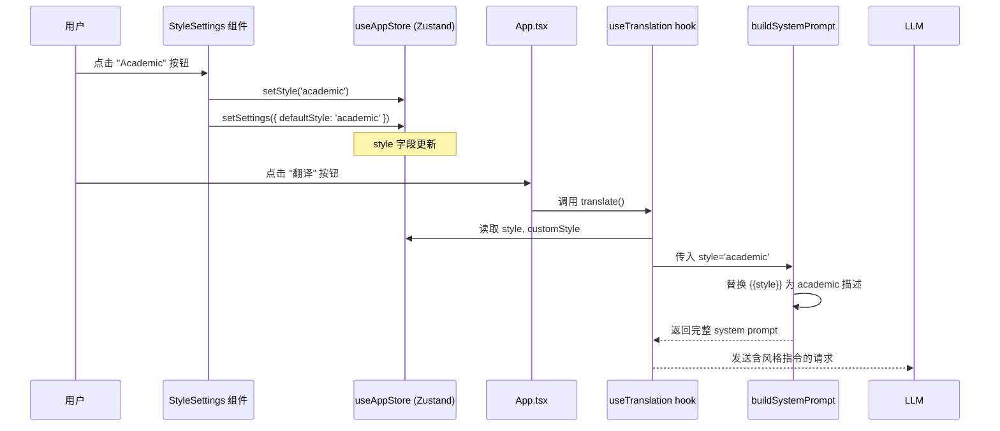

现在信息收集完毕，开始撰写 Wiki 页面。

---

# 翻译风格与自定义指令

翻译不仅是语言转换，更是语气的再现。Moe Translate 提供了一套从 **预设风格** 到 **完全自定义指令** 的层级化控制体系，让 LLM 的输出精准匹配你的语境需求。本文深入分析其实现机制：风格选择如何从 UI 流经状态管理，最终注入 system prompt 的全链路。

## 五种内置风格

`prompts.yaml` 的 `styles` 字段定义了六条风格描述（含 `custom` 占位符），每种对应一个具体的 prompt 指令片段：

| 风格键 | 显示名 | Prompt 描述 |
|--------|--------|-------------|
| `formal` | 正式 | "Use formal, professional language appropriate for business or official contexts." |
| `casual` | 休闲 | "Use casual, conversational language appropriate for everyday communication." |
| `academic` | 学术 | "Use academic language with precise terminology, suitable for scholarly work." |
| `literary` | 文学 | "Use literary language with expressive elements, suitable for literary works." |
| `unspecified` | 未指定 | "Use contextually appropriate style. Analyze the text to determine whether formal, casual, academic, or literary tone best fits the content and target audience." |
| `custom` | 自定义 | `"{{custom_style}}"` — 这是一个模板变量占位符，运行时被用户输入的内容替换。 |

[来源](src/lib/prompts/prompts.yaml#L94-L101)

选择风格时，`StyleSettings` 组件渲染六个按钮，用户点击后调用 `useAppStore.setStyle` 将风格键存入 Zustand store。如果选择 `custom`，还会展开一个 `<textarea>` 供输入自定义描述，内容通过 `setCustomStyle` 存入同名字段。

[来源](src/components/StyleSettings/StyleSettings.tsx#L15-L68)

---

## buildSystemPrompt：风格注入的核心逻辑

`loadPrompts.ts` 中的 `buildSystemPrompt` 函数负责将风格文本拼接到 system prompt 中。其处理流程如下：

```
从 prompts.yaml 加载模板
     │
     ▼
替换 {{source_lang}} 和 {{target_lang}} 为语言全称
     │
     ▼
判断 style 参数：
  ├─ 'custom' + customStyle？ → 用 prompts.styles.custom 模板，将 {{custom_style}} 替换为用户输入
  └─ 其他预设 → 从 prompts.styles 字典中取出对应的描述文本
     │
     ▼
替换模板中的 {{style}} 占位符
     │
     ▼
附加自定义指令（customInstructions）
     │
     ▼
附加术语表（glossary）
     │
     ▼
返回最终 system prompt
```

关键代码片段：

```typescript
if (style === 'custom' && customStyle) {
  systemPrompt = systemPrompt.replace(
    '{{style}}',
    prompts.styles.custom.replace('{{custom_style}}', customStyle)
  );
} else {
  const styleText = prompts.styles[style] || prompts.styles.formal;
  systemPrompt = systemPrompt.replace('{{style}}', styleText);
}
```

注意回退逻辑：如果传入的 `style` 键在 `prompts.styles` 中不存在，默认使用 `formal`。`unspecified` 风格则是一个有意识的"无指定"选择——它让 LLM 自行判断语境。

[来源](src/lib/prompts/loadPrompts.ts#L137-L176)

`buildSystemPrompt` 有多个变体服务于不同场景：`buildSystemPromptLong`（长文本翻译）、`buildDocSystemPrompt`（文档翻译）、`buildAlternativeSystemPrompt`（替代翻译）。它们的风格处理逻辑完全一致，只是 system prompt 模板不同。详见[翻译模式与解释模式详解](翻译模式与解释模式详解.md)。

[来源](src/lib/prompts/loadPrompts.ts#L179-L215) | [来源](src/lib/prompts/loadPrompts.ts#L260-L297) | [来源](src/lib/prompts/loadPrompts.ts#L502-L537)

---

## StyleSettings ↔ useAppStore ↔ App.tsx 联动链路

完整的风格数据流如下图所示：



三个关键细节：

1. **`style` 是顶层状态**：`useAppStore` 中 `style` 和 `customStyle` 是顶层字段（非嵌套在 `settings` 内），因此 `StyleSettings` 可以直接通过解构读取和更新，无需经过 `settings` 对象。

2. **单击即持久化**：选择非 custom 风格时，`handleStyleChange` 同时调用 `setStyle`（更新当前会话风格）和 `setSettings({ defaultStyle: newStyle })`（持久化到 IndexedDB）。下次刷新页面时，`loadSettingsFromDb` 会将 `defaultStyle` 回填到 `style` 字段。

3. **翻译时才读取**：`useTranslation.ts` 中的 `translate` 函数在用户点击翻译按钮后，从 store 中读取当前的 `style` 和 `customStyle`，然后调用 `buildSystemPrompt`。风格变更不是即时生效的，而是随下一次翻译请求一起提交。

[来源](src/hooks/useAppStore.ts#L79-L81) | [来源](src/hooks/useTranslation.ts#L85-L99) | [来源](src/hooks/useAppStore.ts#L116-L123)

---

## CustomInstructions：自定义指令与术语表

`StyleSettings` 只能控制翻译的"语气"，而 `CustomInstructions` 组件提供了更细粒度的约束：**自定义指令** 和 **术语表**（glossary）。

### 组件结构

`CustomInstructions` 是一个模态面板，包含两个标签页：

| 标签页 | 存储 Key | 用途 |
|--------|----------|------|
| 指令 (Instructions) | `customInstructions` | 用户输入任何希望 LLM 遵循的额外约束 |
| 术语表 (Glossary) | `glossary` | 规定特定词汇的翻译方案，避免歧义 |

两个字段分别通过 `getSetting` / `saveSetting` 读写 IndexedDB，独立于 Zustand store 持久化。保存后关闭面板即可生效。

[来源](src/components/CustomInstructions/CustomInstructions.tsx#L10-L98)

### 注入位置

在 `buildSystemPrompt` 的末尾，自定义指令和术语表以附加文本的形式追加到 system prompt 之后：

```typescript
if (customInstructions) {
  systemPrompt = systemPrompt + '\n\n' + customInstructions;
}

if (glossary) {
  systemPrompt = systemPrompt + '\n\nGlossary (use these translations consistently):\n' + glossary;
}
```

术语表前会加上固定的引导句 "Glossary (use these translations consistently):"，提示 LLM 优先遵循。

[来源](src/lib/prompts/loadPrompts.ts#L168-L173)

### 读取时机

`useTranslation.ts` 中的 `translate` 和 `fetchAlternatives` 函数在每次翻译前，从 IndexedDB 异步读取这两个字段：

```typescript
const [customInstructions, glossary] = await Promise.all([
  getSetting('customInstructions') as Promise<string | undefined>,
  getSetting('glossary') as Promise<string | undefined>
]);
```

这意味着修改 `CustomInstructions` 后无需重启应用，下一次翻译即可生效。

[来源](src/hooks/useTranslation.ts#L85-L87)

最终生成的 system prompt 结构如下：

```
You are a professional translator... [模板内容]
The user has requested the following style/tone: [风格描述]

[自定义指令]

Glossary (use these translations consistently):
[术语表内容]
```

---

## 实际示例：初中生友好的翻译风格

假设你想将英语科技文章翻译为中文，但希望用简单词汇，适合初中生阅读。配置步骤如下：

1. **选择 Custom 风格**：在 `StyleSettings` 中点击 "Custom" 按钮。
2. **输入风格描述**：在展开的文本框中输入：
   ```
   用简单的词汇，适合初中生阅读。避免专业术语和复杂句式，用日常中文表达。
   ```
3. **翻译时触发替换**：`buildSystemPrompt` 检测到 `style === 'custom'`，将 `{{style}}` 替换为：
   ```
   Use simple words suitable for middle school students. Avoid technical terms and complex sentence structures. Use everyday Chinese expressions.
   ```
   > 注意：风格描述以英文写入 LLM prompt，因为预设模板是英文的。用户可以在 `CustomInstructions` 中补充中文指令来叠加约束。

4. **注入最终 system prompt** 的样式部分为：
   ```
   The user has requested the following style/tone: Use simple words suitable for middle school students. Avoid technical terms and complex sentence structures. Use everyday Chinese expressions.
   ```

如果你还希望特定术语保持原文（例如 "AI" 不翻译成"人工智能"），可以打开 `CustomInstructions`，在 "Glossary" 标签页添加：

```
AI → AI
Machine Learning → 机器学习（首次出现时附英文）
```

这些内容将作为术语表追加到 prompt 末尾，LLM 会优先遵循。

[来源](src/lib/prompts/loadPrompts.ts#L100) | [来源](src/lib/prompts/loadPrompts.ts#L137-L176)

---

## 补充说明

- `buildSystemPrompt` 的 `mode` 参数决定了使用 `translation` 还是 `parsing` 模板，但两种模板都包含 `{{style}}` 占位符，因此 **解释模式也同样受风格控制**。详见[翻译模式与解释模式详解](翻译模式与解释模式详解.md)。
- 文档翻译和长文本翻译使用独立的 `buildSystemPromptLong` / `buildDocSystemPrompt`，风格替换逻辑与标准翻译完全一致。详见[长文本与文档翻译的分段策略](长文本与文档翻译的分段策略.md)。
- 替代翻译（Alternatives）功能使用 `buildAlternativeSystemPrompt`，风格替换逻辑相同，但默认回退风格为 `unspecified` 而非 `formal`，以鼓励多样性。详见[替代翻译（Alternatives）功能](替代翻译-alternatives-功能.md)。
- 风格和自定义指令的持久化策略详见[状态管理：Zustand 与持久化策略](状态管理-zustand-与持久化策略.md)。
- YAML 提示词引擎的整体架构详见[YAML 驱动的提示词引擎](yaml-驱动的提示词引擎.md)。
- 测试覆盖了 `buildSystemPrompt` 对四种风格和自定义风格的替换正确性，可参考 `promptBuilder.test.ts`。[来源](src/tests/unit/promptBuilder.test.ts#L12-L33)