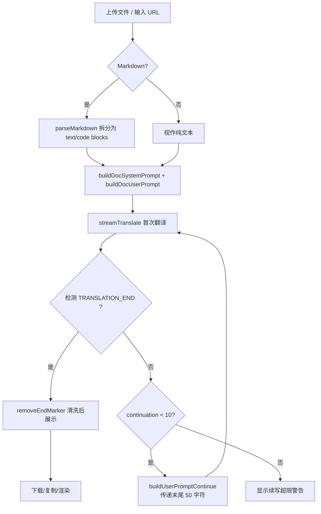

下面是我基于 `DocumentTranslation.tsx` 和 `loadPrompts.ts` 源码构建的 Wiki 页面。

---

# 长文本与文档翻译的分段策略

文档翻译面临的本质问题很简单：**LLM 有输出长度限制，但文档可以无限长**。Moe Translate 的分段策略围绕一个核心机制展开——让 LLM 在翻译完成时主动声明结束，否则就续写，直到文档被完整翻译。

## 问题背景：输出窗口的硬约束

所有商用 LLM 都有 **max_output**（最大输出 Token）限制，例如 DeepSeek V4 Flash 为 128K tokens，GPT-5.4 Mini 为 128K tokens，Cohere Command Light 仅 4K tokens。另一方面，文档翻译的场景天然跨越这些边界——一篇文章可能几万字，一本书可能几十万字。

最简单的做法是人工切段、逐段翻译然后拼接，但这种方式破坏了文档的上下文连贯性。Moe Translate 采用了一种 **"先完整输出，不足则续写"** 的策略，让 LLM 自己掌握翻译的节奏。

[来源](src/lib/prompts/prompts.yaml#L165-L177)

## 一、Markdown 预解析：代码块保护

译文保留 Markdown 结构是文档翻译的硬需求。但代码块（``` 包裹的内容）有特殊性——它们不应被翻译。`parseMarkdown` 函数在翻译前执行一次预处理：

```typescript
function parseMarkdown(text: string): ParsedContent {
  const blocks: ContentBlock[] = [];
  const codeBlockRegex = /^(```[\s\S]*?```)/gm;
  // ...逐块分离 text 和 code
}
```

它使用正则 `/^(```[\s\S]*?```)/gm` 逐行扫描，将文档拆分为交替的 `text` 和 `code` 两类 block。但注意：**这个解析结果仅用于 UI 层判断**（Markdown 渲染器 vs 纯文本渲染）。实际的翻译输入仍然是 `parsed.plainText`——即原始文档全文，不筛除代码块。代码块保护的责任在 **system prompt** 中：

> "Translate headings, lists, and paragraphs, but do NOT translate content inside code blocks (between ``` markers)."

也就是说，**策略上要求 LLM 自觉跳过代码块，而非在前端过滤**。这是一个设计上的权衡——不在用户侧丢失信息，但依赖于模型对指令的遵循程度。

[来源](src/components/DocumentTranslation/DocumentTranslation.tsx#L32-L57)
[来源](src/lib/prompts/prompts.yaml#L77-L78)

## 二、首次翻译：完整文档的首次尝试

`handleTranslate` 入口触发后，流程如下：

1. **构建 system prompt**：`buildDocSystemPrompt(sourceLang, targetLang, style)` 从 prompts.yaml 加载 `system.doc_translation` 模板，替换 `{{source_lang}}`、`{{target_lang}}`、`{{style}}` 变量。
2. **构建 user prompt**：`buildDocUserPrompt(sourceLang, targetLang, text)` 加载 `user.doc_translation` 模板，嵌入全文内容。
3. **发起流式调用**：通过 `streamTranslate` 发送至 LLM API，`onChunk` 回调逐个拼接字符到 `fullResponse`。

此处使用的模板来自 [YAML 驱动的提示词引擎](yaml-驱动的提示词引擎.md)，支持通过 `loadPromptsFromDB()` 从 IndexedDB 加载自定义覆盖。

[来源](src/components/DocumentTranslation/DocumentTranslation.tsx#L119-L140)
[来源](src/lib/prompts/loadPrompts.ts#L137-L169)

## 三、完成信号：`TRANSLATION_END_MARKER`

`checkTranslationComplete` 的逻辑极简：

```typescript
export const TRANSLATION_END_MARKER = '<!-- TRANSLATION_END -->';

export function checkTranslationComplete(content: string): boolean {
  return content.includes(TRANSLATION_END_MARKER);
}
```

LLM 被要求在翻译完成时，在响应末尾插入 `<!-- TRANSLATION_END -->`。这是一个 HTML 注释标记，在 Markdown 渲染中不可见，但程序可精准检测。

system prompt 中对此有明确指令（第 2 条）：

> "When you finish translating the ENTIRE document, you MUST end your response with the marker: <!-- TRANSLATION_END -->"

**为什么不用更常见的方案（如 JSON 结构、特殊 token）？** `<!-- TRANSLATION_END -->` 的选择体现了三个考量：

- **Markdown 兼容**：HTML 注释在渲染时完全不可见，不影响文档外观；
- **自然语言友好**：LLM 对这种明确标记的理解成本低；
- **无视位置**：只要出现在字符串中即可检测，容错性好。

[来源](src/lib/prompts/loadPrompts.ts#L243-L247)
[来源](src/lib/prompts/prompts.yaml#L73-L74)

## 四、循环续写：最多 10 次的翻译接力

如果首次输出中没有检测到结束标记，`handleTranslate` 进入续写循环：

```typescript
while (!isComplete && continuationCount < maxContinuations) {
  continuationCount++;
  const cleanedResponse = removeEndMarker(fullResponse);
  await tryTranslate('', true);
}
```

每次续写的关键在于 **`buildUserPromptContinue`**：

```typescript
export function buildUserPromptContinue(
  lastContent: string,
  remainingText: string
): string {
  return prompts.user.translation_continue
    .replace('{{last_content}}', lastContent)
    .replace('{{remaining_text}}', remainingText);
}
```

展开后的 prompt 模板为：

> The previous translation was cut off. Please continue translating from where it stopped.
> Last 50 characters of previous translation: "{{last_content}}"
> Continue translating:
> {{remaining_text}}

这里两个设计细节值得注意：

| 参数 | 值 | 意图 |
|------|-----|------|
| `lastContent` | `fullResponse.slice(-50)` | 仅传递末尾 50 字符作为"锚点"，避免重复消耗上下文预算 |
| `remainingText` | `''` (空字符串) | 在第 2 次及之后的续写中，原文不再重复传入，假设模型已在上下文中保留了它 |

`maxContinuations` 硬限制为 **10 次**。如果 10 次续写后仍未检测到 `TRANSLATION_END`，则设置警告信息 `docTranslation.warning`，但已翻译的内容不会丢失——用户仍可下载。

[来源](src/components/DocumentTranslation/DocumentTranslation.tsx#L126-L155)
[来源](src/lib/prompts/loadPrompts.ts#L120-L135)
[来源](src/lib/prompts/defaultPrompts.ts#L83-L92)

## 五、清理标记：面向用户端的输出

用户看到的翻译结果不应包含 `<!-- TRANSLATION_END -->` 这种内部标记。`removeEndMarker` 负责清洗：

```typescript
export function removeEndMarker(content: string): string {
  return content.replace(TRANSLATION_END_MARKER, '').trim();
}
```

该函数在以下位置被调用：

- **下载文件**：`handleDownload` 中清洗后生成 Blob；
- **UI 渲染**：`<MarkdownRenderer>` 和 `<pre>` 均使用 `removeEndMarker(docTargetText)` 清洗后显示；
- **剪贴板复制**：复制操作同样调用 `removeEndMarker`。

[来源](src/lib/prompts/loadPrompts.ts#L249-L251)
[来源](src/components/DocumentTranslation/DocumentTranslation.tsx#L161-L174)

## 六、Token 预警：防止"请求即失败"

翻译开始前，`handleTranslate` 的 **"Translate" 按钮** 受 `isTooLong` 条件保护：

```typescript
const estimatedTokens = Math.ceil(docSourceText.length / 3.5);
const maxContext = getModelMaxContext(settings.selectedModel);
const isTooLong = estimatedTokens > maxContext;
```

这里有一个已知的技术债务标记在注释中：

```typescript
// TODO: Implement proper tokenizer for accurate token counting
// Current estimation uses: characters / 3.5 ≈ tokens
// When implementing, consider:
// - Different tokenizers for different models (cl100k_base for GPT-4, etc.)
// - Store tokenizer configuration per custom model
// - Use tiktoken or similar library for accurate counting
```

当前估算 `字符数 / 3.5` 是一个粗糙的经验值，实际 Token 数因语种而异——中文约 1.5 字符/token，英文约 3.5 字符/token。这个问题在 [离线策略与性能优化](离线策略与性能优化.md) 中有更详细的讨论。

`getModelMaxContext` 从 prompts.yaml 中定义的 **max_context** 字段读取，对所有内置/自定义模型均有效。超出时按钮禁用，并展示警告信息。

[来源](src/components/DocumentTranslation/DocumentTranslation.tsx#L176-L178)
[来源](src/lib/prompts/loadPrompts.ts#L220-L224)

## 七、URL 获取：通过 Jina Reader 将网页转为 Markdown

除上传文件外，文档翻译支持直接输入 URL。`handleUrlFetch` 利用 **Jina AI 的 Reader API** 将网页内容提取为 Markdown：

```typescript
const fetchUrl = `https://r.jina.ai/${encodedUrl}`;
const headers: Record<string, string> = { 'Accept': 'application/json' };
if (settings.jinaApiKey) {
  headers['Authorization'] = `Bearer ${settings.jinaApiKey}`;
}
```

配置方式：

- Jina API Key 保存在 `settings.jinaApiKey` 字段；
- 通过 [API 密钥与提供商配置](api-密钥与提供商配置.md) 中的设置面板输入；
- 无 API Key 时仍可调用（免费额度有速率限制），仅不传 `Authorization` 头。

响应格式为 JSON，从 `data.content` 或 `content` 提取网页文本。获取成功后会设置 `isMarkdown = true`，因为 Jina Reader 默认输出 Markdown 格式的正文。

[来源](src/components/DocumentTranslation/DocumentTranslation.tsx#L69-L102)
[来源](src/hooks/useAppStore.ts#L37-L38)

## 总结：分段策略的数据流



## 推荐阅读

- [YAML 驱动的提示词引擎](yaml-驱动的提示词引擎.md) — 深入了解提示词模板如何加载、缓存和自定义覆盖
- [翻译模式与解释模式详解](翻译模式与解释模式详解.md) — 对比文档翻译与普通翻译模式的 system prompt 差异
- [LLM 流式 API 客户端架构](llm-流式-api-客户端架构.md) — `streamTranslate` 的 SSE 解析与 AbortController 实现细节
- [离线策略与性能优化](离线策略与性能优化.md) — Token 计数估算问题的完整讨论
- [状态管理：Zustand 与持久化策略](状态管理-zustand-与持久化策略.md) — `docSourceText` / `docTargetText` 等状态的持久化机制