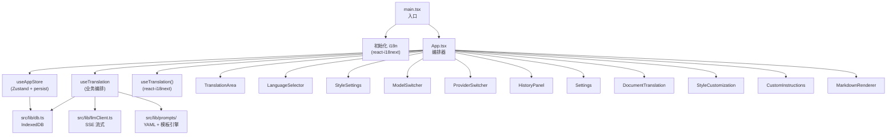
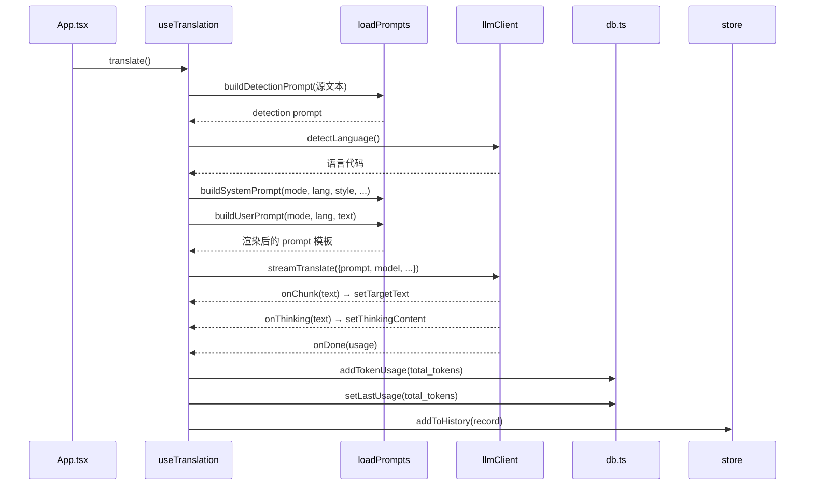
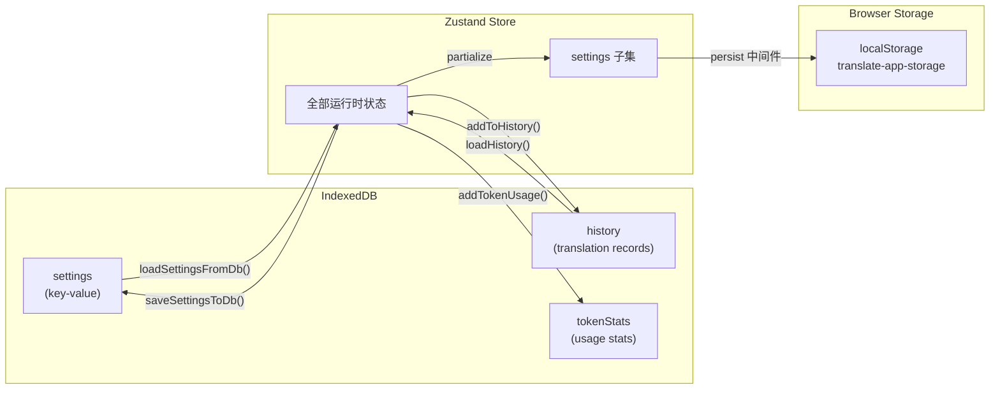

现在我已掌握完整的项目结构信息，开始撰写 Wiki 页面。

---

# 项目结构与模块依赖图

## 全景概览

Moe Translate 是一个典型的 **React SPA**，采用三层架构组织代码。从 `main.tsx` 发起到浏览器 DOM 挂载，再到用户交互的完整链路，清晰地勾勒出"入口 → 状态层 → 数据层 → UI 层"的依赖关系。



[来源](src/main.tsx#L1-L9)[来源](src/App.tsx#L1-L49)

---

## 三层架构详解

### 第一层：UI 层（`src/components/`）

共 **12 个组件目录**，每个组件（除少数例外）包含 `.tsx`、`.css` 和可选的 `index.ts` barrel 文件：

| 组件目录 | 功能定位 | 挂载方式 |
|---|---|---|
| `TranslationArea/` | 受控/非受控文本输入/输出区域 | 始终渲染于主面板 |
| `LanguageSelector/` | 源语言/目标语言下拉选择 | source 面板 + target 面板各一个 |
| `StyleSettings/` | 翻译风格选择与自定义 | source 面板底部 |
| `ModelSwitcher/` | 模型选择下拉 | header 区域 |
| `ProviderSwitcher/` | 提供商选择下拉 | header 区域 |
| `ModeSwitcher/` | 翻译/解释/文档三 tab 切换 | 导航栏 (实际由 `handleTabChange` 内联渲染) |
| `HistoryPanel/` | 历史记录与收藏侧面板 | 条件覆盖层 `{showHistory && <HistoryPanel/>}` |
| `Settings/` | API Key、自定义语言/模型等 | 条件覆盖层 |
| `DocumentTranslation/` | 文件/URL 文档翻译面板 | 条件 tab 渲染 |
| `StyleCustomization/` | CSS 变量实时预览与自定义 CSS | 条件覆盖层 |
| `CustomInstructions/` | 自定义指令与术语表编辑 | 条件覆盖层 |
| `ThinkingChain/` | 思考链展示（reasoning_content） | 内联渲染于 target 面板内 |
| `MarkdownRenderer/` | 基于 react-markdown 的渲染器 | 条件渲染（explain 模式默认启用） |

每个组件通过 **Props** 从 `App.tsx` 接收回调或数据，组件本身不直接引用 Zustand store，而是通过父组件传入的 props 与外界通信。少数组件（如 `HistoryPanel`）内部直接调用 `useAppStore` 的 action，属于例外。

[来源](src/App.tsx#L1-L49)[来源](README.md#L98-L119)

---

### 第二层：状态层（`src/hooks/`）

#### `useAppStore` — Zustand 全局状态

位于 `src/hooks/useAppStore.ts`，是整个应用的状态中心。它管理三大类状态：

1. **翻译会话状态**：`sourceText`、`targetText`、`sourceLang`、`targetLang`、`isStreaming`、`thinkingContent`、`translationError`
2. **UI 控制状态**：`showHistory`、`showSettings`、`activeTab`、`showAlternatives`
3. **持久化设置**：`settings` 子对象，包含 `selectedProvider`、`selectedModel`、`providerApiKeys`、`customProviders`、`customLanguages`、`jinaApiKey` 等

**持久化策略的关键点** — 使用了 Zustand 的 `persist` 中间件：

```typescript
persist(
  (set, get) => ({ /* 全部状态 */ }),
  {
    name: 'translate-app-storage',   // localStorage 键名
    partialize: (state) => ({
      settings: state.settings        // 只持久化 settings 子集
    }),
    onRehydrateStorage: () => (state) => {
      // 启动时对旧版数据做兼容处理：
      // - 确保 customProviders 是数组
      // - 将旧的 apiKey 字符串迁移到 providerApiKeys 对象
      // - 设置默认 selectedProvider / selectedModel
    }
  }
)
```

`partialize` 配置意味着**只有 `settings` 对象会被序列化到 `localStorage`**，而 `sourceText`、`targetText`、`isStreaming` 等会话状态在页面刷新后会丢失——这是有意为之的设计，避免缓存敏感或临时数据。

`onRehydrateStorage` 回调在应用启动时从 `localStorage` 反序列化数据，并执行数据迁移逻辑，确保旧版本的 `apiKey` 字段能正确映射到新的 `providerApiKeys` 结构。

[来源](src/hooks/useAppStore.ts#L129-L194)

#### `useTranslation` — 业务编排 Hook

位于 `src/hooks/useTranslation.ts`，是翻译流程的**指挥中心**。它封装了整个翻译管道的编排：



关键设计细节：
- 使用 `useRef` 持有 `AbortController`，支持通过 `stopTranslation()` 中断流式请求
- `getApiConfig()` 通过 `resolveModelConfig()` 解析当前选择的提供商和模型配置，合并自定义提供商
- 翻译完成后自动调用 `addToHistory()` 将结果写入 IndexedDB
- `fetchAlternatives()` 流程与 `translate()` 并行，使用独立的 prompt 模板（`buildAlternativeSystemPrompt` / `buildAlternativeUserPrompt`）

[来源](src/hooks/useTranslation.ts#L1-L51)

---

### 第三层：数据层（`src/lib/`）

#### `db.ts` — IndexedDB 封装

三个 object store：

| Store | keyPath | 用途 |
|---|---|---|
| `history` | `id` (autoIncrement) | 翻译记录，索引 `timestamp` 和 `isFavorite` |
| `settings` | `key` | 键值对存储所有设置项 |
| `tokenStats` | `key` | Token 消耗统计 |

封装了 `getDB()` 惰性连接、CRUD 操作、自动清理（最多保留 1000 条非收藏记录 / 30 天过期）、导入导出等功能。

[来源](src/lib/db.ts#L54-L82)

#### `llmClient.ts` — LLM 流式 API 客户端

核心函数 `streamTranslate()`：
- 构建 `fetch` POST 请求到 `{apiBaseUrl}/chat/completions`
- 通过 `response.body.getReader()` 逐行解析 SSE 流
- 解析 `reasoning_content` 字段（支持思考链模型如 DeepSeek Reasoner）
- 支持 `AbortSignal` 中断
- 非流式函数 `detectLanguage()` 用于自动语言检测

[来源](src/lib/llmClient.ts#L1-L142)

#### `prompts/` — YAML 驱动的提示词引擎

- `prompts.yaml`：集中定义所有 prompt 模板、语言列表、提供商/模型配置、风格描述
- `loadPrompts.ts`：解析 YAML，提供模板变量替换（`{{source_lang}}`、`{{target_lang}}`、`{{text}}`、`{{style}}` 等）
- `defaultPrompts.ts`：运行时默认值（fallback）
- 支持从 IndexedDB 加载自定义 prompt 覆盖（`loadPromptsFromDB()`），实现运行时 prompt 热更新

[来源](src/lib/prompts/loadPrompts.ts#L1-L68)

---

## 渲染链路：`main.tsx → App.tsx → 组件树`

完整的组件渲染链路如下：

```
main.tsx
  └── <StrictMode>
        └── <App />                           ← 此时已初始化 i18n
              │
              ├── header (ProviderSwitcher + ModelSwitcher + 工具栏按钮)
              ├── nav (Tab 导航: 翻译/解释/文档)
              │
              ├── [activeTab === 'doc']
              │     └── <DocumentTranslation />
              │
              ├── [activeTab === 'translate' | 'explain']
              │     └── main (.app-main)
              │           ├── .source-panel
              │           │     ├── <LanguageSelector />        (source)
              │           │     ├── <TranslationArea />         (source text)
              │           │     └── <StyleSettings />
              │           ├── .swap-btn (交换按钮)
              │           └── .target-panel
              │                 ├── <LanguageSelector />        (target)
              │                 ├── <TranslationArea />         (target text / readOnly)
              │                 │   └── [renderMarkdown]
              │                 │         └── <MarkdownRenderer />
              │                 ├── [showThinking]
              │                 │     └── thinking-inline (思考链)
              │                 ├── translate-btn (翻译按钮)
              │                 ├── [translationError]
              │                 ├── [lastTokenUsage] (token 消耗徽章)
              │                 ├── [showAlternatives]
              │                 │     └── alternatives-container
              │                 └── [isLoadingAlternatives]
              │
              ├── [showHistory]
              │     └── <HistoryPanel />
              ├── [showSettings]
              │     └── <Settings />
              ├── [showStyleCustomization]
              │     └── <StyleCustomization />
              ├── [showCustomInstructions]
              │     └── <CustomInstructions />
              └── [showFullscreenResult]
                    └── fullscreen-result-overlay
```

**关键观察**：`App.tsx` 是一个**巨型编排器**（约 650 行），它同时承担了路由分发、状态连接、UI 状态管理（大量 `useState`）和条件渲染逻辑。部分 UI 元素（如 Alternatives 列表、ThinkingChain、Token 消耗徽章）直接内联在 `App.tsx` 中，未拆分为独立组件。

[来源](src/App.tsx#L38-L650)

---

## App.tsx 中的 Hooks 调用位置

在 `App.tsx` 的函数体顶部（第 38-49 行），有三个 hooks 同时被调用：

```typescript
function App() {
  // 1. Zustand store — 解构出所有状态与 actions
  const {
    sourceLang, targetLang, setSourceLang, setTargetLang,
    mode, setMode, isStreaming, thinkingContent,
    showHistory, setShowHistory, showSettings, setShowSettings,
    settings, loadHistory, loadFavorites, loadSettingsFromDb,
    activeTab, setActiveTab, alternatives, showAlternatives,
    isLoadingAlternatives, setShowAlternatives,
    setTargetText, originalTranslation, translationError
  } = useAppStore();

  // 2. 业务编排 hook — 翻译核心函数
  const { translate, fetchAlternatives, stopTranslation } = useTranslate();

  // 3. react-i18next 国际化 hook
  const { t } = useTranslation();
```

这三个 hooks 分别对应三层架构中的 **状态层**（Zustand store）、**业务逻辑层**（翻译编排）、**国际化层**（i18n）。其中 `useTranslation` 有两个不同的导入来源——来自 `react-i18next` 的和来自 `./hooks/useTranslation` 的，通过别名区分。

[来源](src/App.tsx#L38-L49)

---

## Zustand persist 数据流详解

`useAppStore` 的持久化机制是理解整个应用**数据生命周期**的关键：



**持久化路径有两套**：

1. **Zustand persist → localStorage**：通过 `partialize` 配置，仅 `settings` 子集被自动同步到 `localStorage`，键名为 `translate-app-storage`。页面刷新后，`onRehydrateStorage` 负责反序列化和数据迁移。
2. **IndexedDB → settings store**：`saveSettingsToDb()` 手动将 `settings` 的每个字段写入 `settings` store。`loadSettingsFromDb()` 在 `useEffect` 中启动时调用，从 IndexedDB 读取并更新 Zustand 状态。

这两套路径**存在冗余**。实际运行时，应用启动时的加载顺序为：
1. Zustand persist 从 `localStorage` 恢复 `settings`（同步，阻塞 hydration）
2. `onRehydrateStorage` 回调执行数据迁移
3. `useEffect` 中调用 `loadSettingsFromDb()`（异步），用 IndexedDB 中的完整设置覆盖 Zustand 状态
4. `loadHistory()` 和 `loadFavorites()` 同样在 `useEffect` 中异步加载

**为什么需要两套？**
- `localStorage` persist 让页面刷新后能立即恢复提供商/模型选择等 UI 关键设置，避免空白闪烁
- IndexedDB 存储完整的设置历史（如 CSS 变量、自定义指令、术语表），这些数据量较大且不要求即时可用

[来源](src/hooks/useAppStore.ts#L129-L194)[来源](src/App.tsx#L143-L148)

---

## 推荐阅读

- [状态管理：Zustand 与持久化策略](状态管理-zustand-与持久化策略.md) — 深入分析 partialize、onRehydrateStorage 和 migrate 策略
- [IndexedDB 数据层设计](indexeddb-数据层设计.md) — history、settings、tokenStats 三个 store 的完整 schema
- [LLM 流式 API 客户端架构](llm-流式-api-客户端架构.md) — SSE 解析与 AbortController 中断机制
- [YAML 驱动的提示词引擎](yaml-驱动的提示词引擎.md) — 模板变量替换与多模式 prompt 管理
- [构建工具链与配置](构建工具链与配置.md) — Vite + TypeScript + PWA 构建管线